# 航空航天精密复杂部件非接触式表面处理技术商业计划书

01

企业与团队

02

二、 行业与市场

03

三、 技术和产品

04

四、商业规划

# CONTENTS

05

五、 融资计划

# 究 环保工艺

# 企业与团队

西安蓝想新材料科技有限公司研制非接触式（激光清理+双高压清理）先进装备，开发可落地工艺技术， 围绕航空航天等国防军工表面预处理市场，开展“绿色高效精准” 表面处理先进技术产业化应用

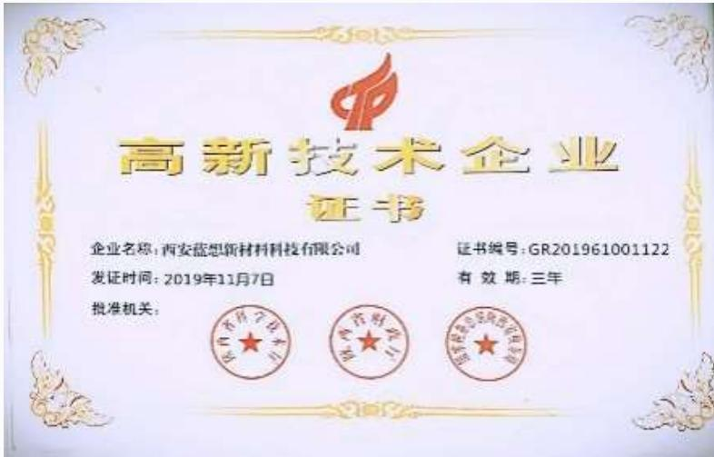

#

#

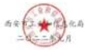

# 资质荣誉

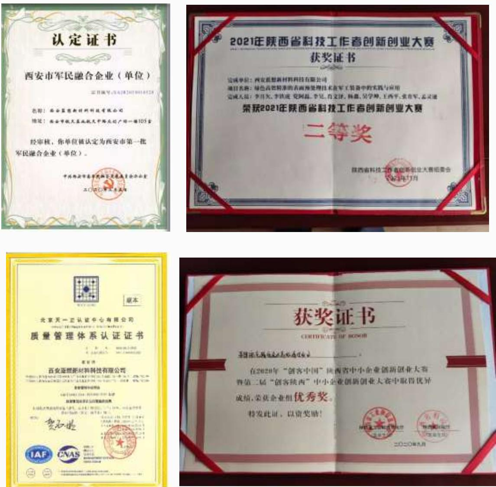

# 技术创新，形成3项发明专利22项实用新型专利

<table><tr><td>专利号（部分)</td><td>部分专利名称</td><td>专利类型</td></tr><tr><td>ZL202021073538.2</td><td>用于航空发动机叶片积碳的激光清理设备</td><td>实用新型</td></tr><tr><td>ZL201820503559.X</td><td>核设施污染物激光清洗设备</td><td>实用新型</td></tr><tr><td>ZL202021078093.7</td><td>航空航天部件减重的双高压环保清理设备</td><td>实用新型</td></tr><tr><td>2020SR0628263</td><td>激光清理热电池盖组件表面氧化皮软件</td><td>软著</td></tr><tr><td>ZL202211070412.3</td><td>锥形复杂燃烧室内腔激光毛化方法及设备</td><td>发明</td></tr><tr><td>ZL201721208533.4</td><td>一种高效环保整车除面漆装置</td><td>实用新型</td></tr><tr><td>ZL201721718829.0</td><td>板材表面处理设备</td><td>实用新型</td></tr><tr><td>ZL202021063059.2</td><td>一种高温合金部件表面毛化的激光清理设备</td><td>实用新型</td></tr><tr><td>ZL202211118355.1</td><td>阳极板贵金属涂层激光剥离回收装置及方法</td><td>发明</td></tr><tr><td>ZL202021050333.2</td><td>航天航空导管内外壁清理的激光清理设备</td><td>实用新型</td></tr></table>

# 核心技术团队

# 公司拥有一支以创始人肖文泽为核心的专业技术团队，在表面处理领域具有高度的创新力、专注力、执行力和协同力

# 肖文泽 创始人/执行董事

# • 国家级领军人才

西工大MBA,西安市科技专家• 核工业工作15年，拥有专利16项• 多项国家省级重点研发计划项目负责人

# 吴学坤 总经理

在江浙担任过八年民企总经理，具有丰富的市场开拓和工厂管理经验• 组织执行力强

# 张锐 工艺专家

航天科技表面工程工艺专家• 研究员高级工程师• 30年表面工程应用研究

# 杨鑫 技术总监

西工大本科学历，已开发10项激光 $^ +$ 水射流设备和工艺方面的专利技术• 产品设计能力及工艺开发能力强

# 产学研合作

公司与多个省内外一流学术单位进行合作，建有蓝想-西工大新材料表面处理联合实验室等专业创新平台，承担了数项国省级技术创新专项

蓝想与广东省科学院新材料研究所、西安热工研究院签订了战略合作协议，在激光涂层剥离、核电站去污清洗等方面技术合作攻关

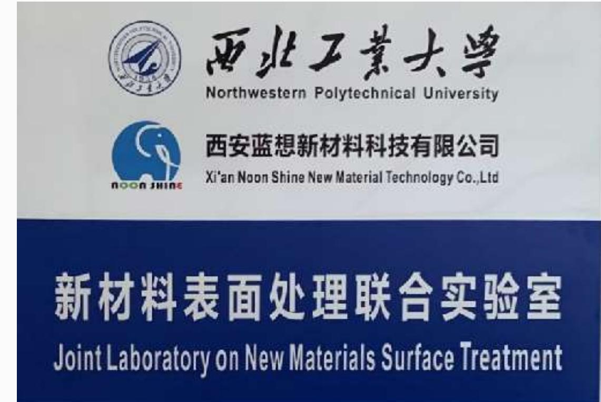

公司独立承担的国省级研发项目  

<table><tr><td rowspan=1 colspan=1>钛合金表面鳞皮双高压绿色高效清理</td><td rowspan=1 colspan=1>2019年陕西省科技培育计划项目</td><td rowspan=1 colspan=1>已验收</td></tr><tr><td rowspan=1 colspan=1>航空航天绿色精准激光表面清理设备产业化</td><td rowspan=1 colspan=1>2020年国家重点研发计划项目</td><td rowspan=1 colspan=1>已验收</td></tr><tr><td rowspan=1 colspan=1>激光清理技术在调姿导弹内腔毛化清洗中的应用</td><td rowspan=1 colspan=1>2022年陕西省重点研发计划项目</td><td rowspan=1 colspan=1>已验收</td></tr><tr><td rowspan=1 colspan=1>航空航天激光清理加工中心</td><td rowspan=1 colspan=1>陕西光子产业链重点发展项目</td><td rowspan=1 colspan=1>执行中</td></tr></table>

# 二、 行业与市场

表面预处理是加工制造业必不可少的环节，很多场合下需要特殊加工手段，往往是制造业的“痛点”与“堵点”

在我国，表面预处理方法总体落后，人工打磨、化学清洗仍广泛使用，污染环境且难以满足军工装备精细化需求

机 械 法

包括人工打磨、喷砂、抛丸痛点1：粉尘大，费工费时，影响操作者身体健康；痛点2：伤基材，无法保证精密工件的型面尺寸；痛点3：效率低，干冰法及高压纯水法无法清洗鳞皮。

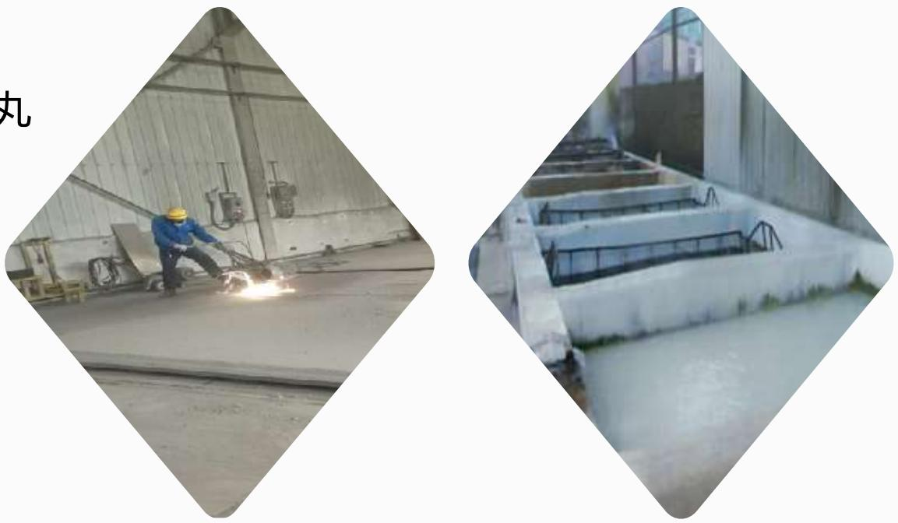

酸碱洗化学法 含超声波清洗

痛点1：产生化学污染严重影响环境；  
痛点2：受酸碱池尺寸限制，厚大板料无法作业；  
痛点3：沟槽处无法清理干净；易出现过酸洗，伤基材。

# 环保政策趋势

# 产业升级趋势

针对表面工程和工业清洗的环保力度持续加大

军工行业精密制造急需精准的表面处理

欧美等国激光、水射流、电化学等先进表面处理工艺，尤其在航空航天、微电子等重点行业正广泛渗透

与国外相比，激光等先进表面处理工艺在国内不仅渗透率低，而且应用附加值也不高

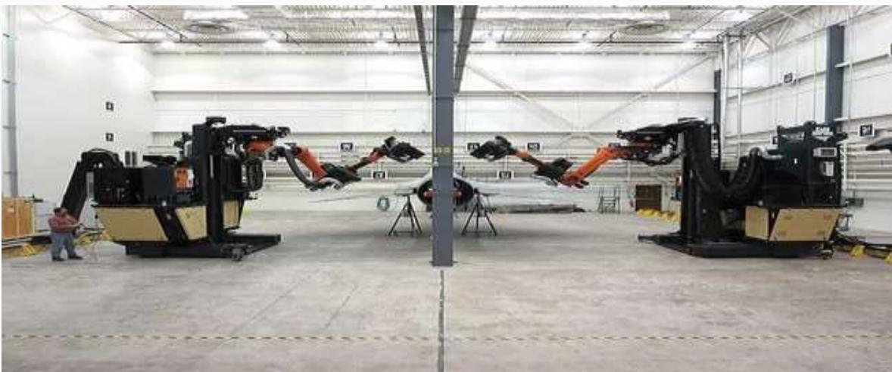  
美国对F16战机进行激光脱漆

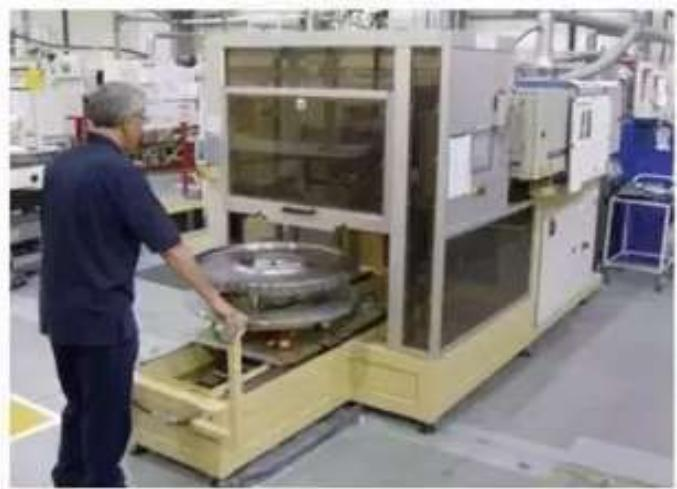

R&R已开发钛合金叶片叶轮激光清洗技术

国外对航空航天发动机领域激光清理技术实行严密封锁：民航发动机不允许在中国大修

2016年华中科技大学研制出国内第一台激光清洗机，现有技术多处于实验室阶段

目前，国内激光清洗大多数应用于铁板除锈、激光平面清洗、激光除漆等，限制了其成长空间

# 目标市场分析

表面预处理市场分布： $\textcircled{1}$ 喷漆、喷塑、热喷涂、焊接、材料复合等表面工程的前处理； $\textcircled{2}$ 设备维修与工业再制造领域的表面前处理； $\textcircled{3}$ 工业清洗

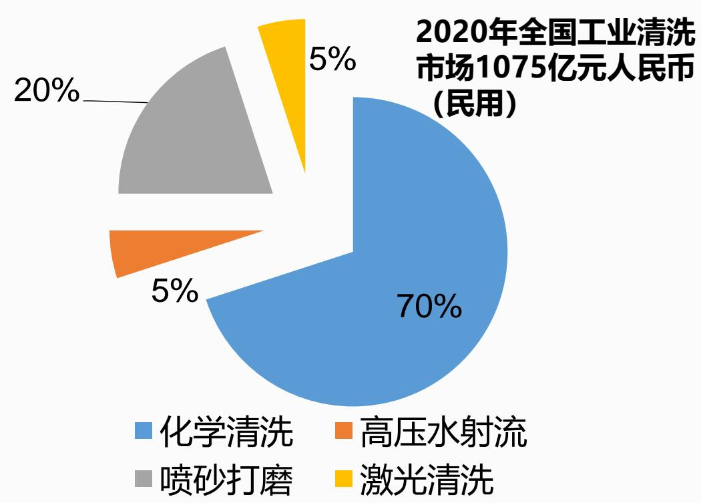

# 存量市场

# 2020年全国民用工业清洗市场已达千亿元级别。

随着激光表处应用增长所带来的规模化成本下降，叠加环保政策的不断收紧，激光有望逐渐替代化学清洗、喷砂打磨等污染工艺，激光加工份额每提高一个百分点就相当于每年10亿元的清洗市场空间。

再考虑非清洗类表面处理，如基于激光的表面毛化、涂层剥离、激光去毛刺、激光抛光等，激光通过替代其他传统技术，有望每年拥有30-50亿元的表面处理存量市场。

# 增量市场

# 以尚处产业化初期且高速增长的工业再制造市场为代表。

2020年，我国工业再制造市场规模已经超过2200亿元。其中，零部件的表面再制造大约占4成，即使保守估计其中只有5%由激光来完成，规模也有望达到44亿元左右。

# 三、 技术和产品

作为国内唯一同时掌握激光清理+双高压清理技术的企业本公司聚焦于向航空航天发动机客户提供非接触式表面处理一站式解决方案

激光清理

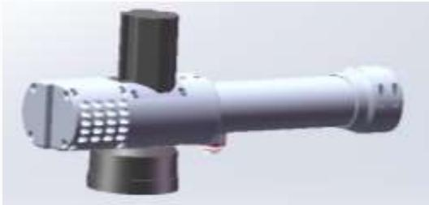

双高压混合清理

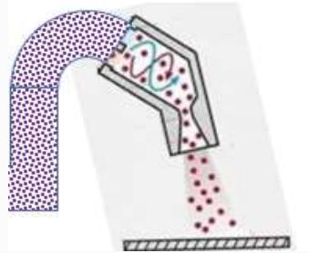

高能束脉冲激光金属表面改性技术

环保无污染：不使用化学药剂及液体

复杂部件： 航发叶片、整体叶盘

精密表处：内腔、曲面、遮蔽区

多种功能：无损清洗 $^ { + }$ 毛化 $^ { + }$ 剥离涂层

双动力： 高压水射流+高压空气

高效：10-25㎡/h

大件：飞机舰船除漆除锈、轧制钛板除鳞皮

安全： 深度重污垢清洗，防火防爆

环保：比干喷砂降低 $9 5 \%$ 以上粉尘

# 竞争优势

# 蓝想

# 基于激光的表面处理市场占有率省内第一，全国前五

率先卡位于有精度要求的军工业表面预处理市场

国内唯一拥有激光清理+双高压清理技术

设备研制+来料加工服务商业模式

# 公司目前已开发

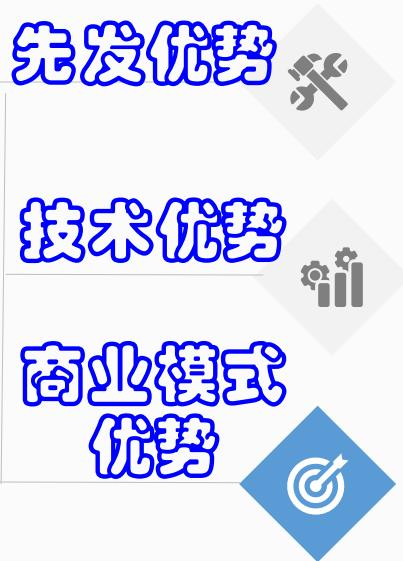

# 表面预处理10大应用场景：

$\textcircled{1}$ 工业表面清洗，去除油污、除污垢等； $\textcircled{2}$ 除锈； $\textcircled{3}$ 除氧化皮 ； $\textcircled{4}$ 除漆； $\textcircled{5}$ 除积碳；$\textcircled{6}$ 除机加刀纹； $\textcircled{7}$ 激光涂层剥离； $\textcircled{8}$ 激光内腔毛化； $\textcircled{9}$ 航空航天物理减重； $\textcircled{10}$ 钛板除鳞皮在研新技术包括：激光去毛刺、激光抛光、激光水射流复合清洗技术

# 核心技术

<table><tr><td rowspan=1 colspan=2>技术名称</td><td rowspan=1 colspan=1>关键技术指标</td><td rowspan=1 colspan=1>应用方向</td></tr><tr><td rowspan=4 colspan=1>激光清理</td><td rowspan=1 colspan=1>1、不产生二次氧化的钛合金激光清洗技术</td><td rowspan=1 colspan=1>常温不包装30天无氧化色</td><td rowspan=1 colspan=1>热电池盖组、叶片、导管等钛合金部件清洗</td></tr><tr><td rowspan=1 colspan=1>2、带锥度狭小内腔表面精准毛化技术</td><td rowspan=1 colspan=1>φ&lt;30mm,毛化一致性好</td><td rowspan=1 colspan=1>调姿导弹燃烧室、小孔</td></tr><tr><td rowspan=1 colspan=1>3、航发涂层激光剥离技术</td><td rowspan=1 colspan=1>TBC、WC、TiN等涂层厚度1-500um剥离不伤基材</td><td rowspan=1 colspan=1>航发耐高温部件、防腐蚀部件、润滑部件等</td></tr><tr><td rowspan=1 colspan=1>4、激光剥离贵金属涂层并回收技术</td><td rowspan=1 colspan=1>贵金属涂层回收率&gt;80%</td><td rowspan=1 colspan=1>航空部件再制造</td></tr><tr><td rowspan=3 colspan=1>双高压清理</td><td rowspan=1 colspan=1>5、轧制钛板高效环保除鳞皮技术</td><td rowspan=1 colspan=1>无污染、无残渣，比砂轮打磨效率提高10倍以上</td><td rowspan=1 colspan=1>钛合金板/管/棒轧制</td></tr><tr><td rowspan=1 colspan=1>6、高温合金部件双高压物理减重技术</td><td rowspan=1 colspan=1>高出现行机加/化学法效率10倍以上</td><td rowspan=1 colspan=1>航空航天需减重的部件</td></tr><tr><td rowspan=1 colspan=1>7、叶轮流道光整清洗技术</td><td rowspan=1 colspan=1>φ1.5m一天内清洗，Ra≤1.6</td><td rowspan=1 colspan=1>焊接后发动机大叶轮</td></tr><tr><td rowspan=1 colspan=1>复合清理</td><td rowspan=1 colspan=1>8、航发部件不产生重熔层的清理技术</td><td rowspan=1 colspan=1>部件表面不产生重熔层</td><td rowspan=1 colspan=1>航发精密复杂部件激光清洗/毛化/剥离</td></tr></table>

# 产品应用—— $\textcircled{1}$ 激光清理设备市场

公司研制开发了NS系列激光清理定制设备，激光叶片3D清洗、激光剥离涂层、航空航天导管内外壁清洗等设备是行业内首台套，填补国内应用空白。已中标/供货的头部客户：

中国航发动力股份有限公司沈阳黎明航空发动机有限公司航天兰州空间技术物理研究所航天科技集团四院7416厂

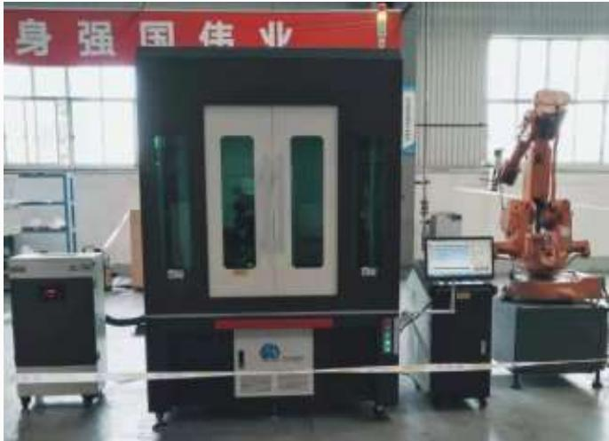

西安航天发动机有限公司航天科工西安210所中船重工703所

兵器工业北方特种能源公司解放军陆军装甲兵学院深圳技术大学

东方汽轮机厂西电避雷器厂宝钛集团  
长庆油田

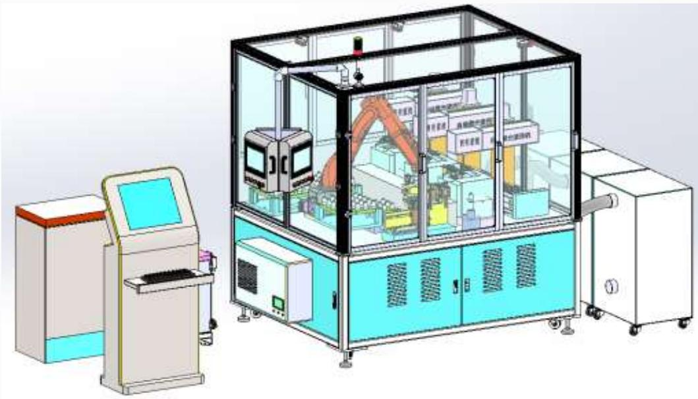

产品应用— ②激光清理来料加工服务市场

公司研制了激光清理生产线，开发稳定工艺，正承接热电池钛合金盖组激光清理氧化皮（取代酸洗工艺）、芯片表面清洗修复、调姿导弹燃烧室内腔激光毛化（取代手工喷砂）等来料加工服务。

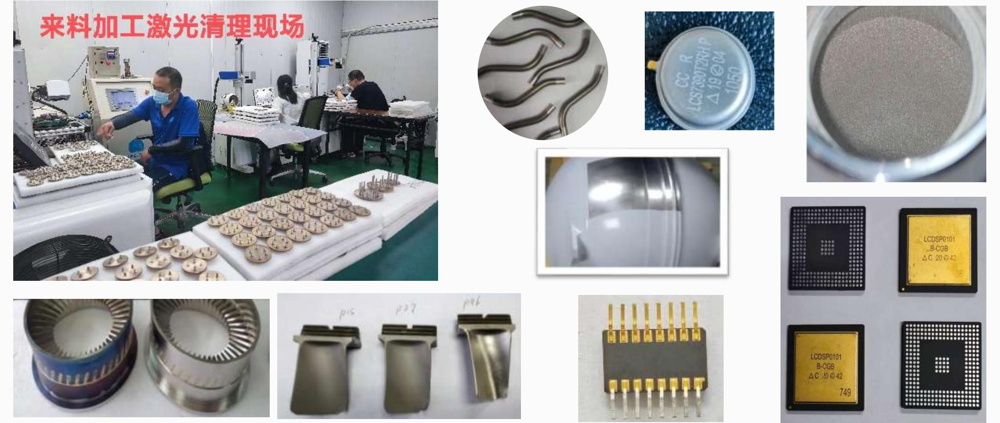

# 产品应用— $\textcircled{3}$ 双高压清理来料加工服务市场

蓝想研制双高压混合清理工程样机，已开发轧制钛板绿色除鳞皮技术成果，正承接轧制钼板除氧化皮、叶轮流道清洗批量加工业务；试制航天半管减重取得重大突破。

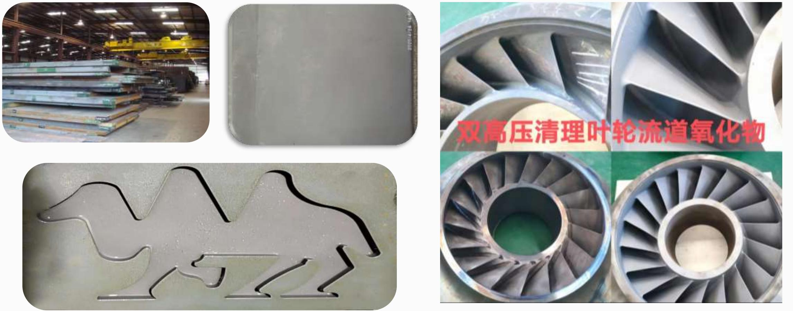

# ➢航空发动机激光表面处理开发应用

# 制造过程应用：

# 大修过程应用：

$\textcircled{3}$ 激光清洗去除压气机叶片、机匣、尾喷管等表面积碳；

$\textcircled{1}$ 激光清洗叶片、导管、燃烧室等焊接前去除氧化皮、油污；$\textcircled{2}$ 激光毛化取代喷砂增加部件表面粗糙度。

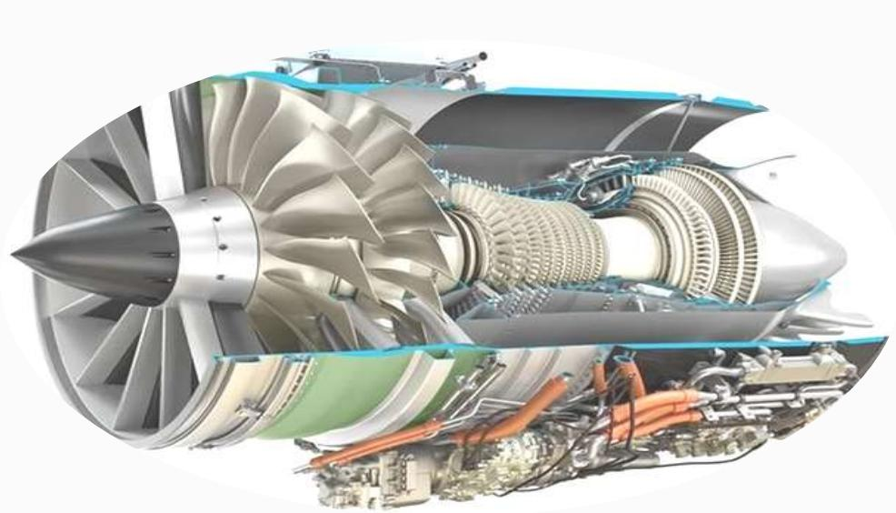

$\textcircled{4}$ 激光清洗除氧化皮；  
$\textcircled{5}$ 激光清洗除漆；  
$\textcircled{6}$ 激光清洗除油污。

# 再制造前处理应用：

$\textcircled{7}$ 激光无损清洗、表面毛化、剥离涂层为再制造部件去污清洁、剥离涂层露出金属本色，涂层制备和喷漆前的激光毛化，取代化学酸碱洗和喷砂打磨。

凭借市场先发和工艺落地领先优势，蓝想公司已成功打入航空航天表面处理供应链！  

<table><tr><td rowspan=1 colspan=1>行业划分</td><td rowspan=1 colspan=1>设备供应</td><td rowspan=1 colspan=1>加工服务提供</td><td rowspan=1 colspan=1>打样实验</td></tr><tr><td rowspan=1 colspan=1>中国航发</td><td rowspan=1 colspan=1>沈阳410厂、1西安430厂</td><td rowspan=1 colspan=1>西安430厂</td><td rowspan=1 colspan=1>株洲331厂、成都420厂、贵阳170厂</td></tr><tr><td rowspan=1 colspan=1>中航工业</td><td rowspan=1 colspan=1></td><td rowspan=1 colspan=1>618所、沈阳117厂、中航光电</td><td rowspan=1 colspan=1>西飞、114厂、115厂、哈飞</td></tr><tr><td rowspan=1 colspan=1>中国商飞</td><td rowspan=1 colspan=1></td><td rowspan=1 colspan=1></td><td rowspan=1 colspan=1>上海飞机制造公司复合材料</td></tr><tr><td rowspan=1 colspan=1>航天科技</td><td rowspan=1 colspan=1>航天四院7416厂、兰州510所</td><td rowspan=1 colspan=1>航天六院11所、7103厂、九院771所</td><td rowspan=1 colspan=1>航天四院43所、504所</td></tr><tr><td rowspan=1 colspan=1>航天科工</td><td rowspan=1 colspan=1>西安210所</td><td rowspan=1 colspan=1>杭州825厂、上海539厂、南京772所</td><td rowspan=1 colspan=1></td></tr><tr><td rowspan=1 colspan=1>特种金属</td><td rowspan=1 colspan=1>宝钛</td><td rowspan=1 colspan=1>西北有色金属研究院、金堆城钼业</td><td rowspan=1 colspan=1>山西银光镁业</td></tr><tr><td rowspan=1 colspan=1>空装维修厂</td><td rowspan=1 colspan=1></td><td rowspan=1 colspan=1></td><td rowspan=1 colspan=1>5702厂、5719厂5706厂</td></tr><tr><td rowspan=1 colspan=1>配套企业</td><td rowspan=1 colspan=1></td><td rowspan=1 colspan=1>梅岭电源、远航真空钎焊、汇腾航空</td><td rowspan=1 colspan=1>陕西华秦</td></tr></table>

# 四、 商业规划

创业历程：2017年9月转型，进入全新行业，潜心研究激光清洗 $+$ 双高压清洗设备，开发工艺；2019年主营业务收入不足50万，克服三年疫情影响，2023年突破550万元并实现盈利。发展规划：公司激光内腔毛化、双高压物理减重等科研课题实现突破，在手订单超过600万元，预计2024年主营业务收入1500万元，当年利润500万元。计划引入战略合作机构，建立完善生产线扩大产能。随着公司几款主打技术进一步成熟，未来几年成长空间还将持续快速打开。

蓝想公司主营收入及盈利预测表  

<table><tr><td rowspan=1 colspan=2>分项主营收入（万元）</td><td rowspan=1 colspan=1>2019年实际</td><td rowspan=1 colspan=1>2020年实际</td><td rowspan=1 colspan=1>2023年实际</td><td rowspan=1 colspan=1>2024年预测</td><td rowspan=1 colspan=1>2025年预测</td><td rowspan=1 colspan=1>2026年预测</td></tr><tr><td rowspan=2 colspan=1>航空航天JG配套行业</td><td rowspan=1 colspan=1>设备生产销售</td><td rowspan=1 colspan=1>0</td><td rowspan=1 colspan=1>84</td><td rowspan=1 colspan=1>250</td><td rowspan=1 colspan=1>800</td><td rowspan=1 colspan=1>1000</td><td rowspan=1 colspan=1>1500</td></tr><tr><td rowspan=1 colspan=1>来料加工及研发实验收入</td><td rowspan=1 colspan=1>32.2</td><td rowspan=1 colspan=1>28</td><td rowspan=1 colspan=1>219</td><td rowspan=1 colspan=1>500</td><td rowspan=1 colspan=1>1600</td><td rowspan=1 colspan=1>3000</td></tr><tr><td rowspan=1 colspan=2>民品行业收入</td><td rowspan=1 colspan=1>15.8</td><td rowspan=1 colspan=1>70</td><td rowspan=1 colspan=1>83</td><td rowspan=1 colspan=1>200</td><td rowspan=1 colspan=1>400</td><td rowspan=1 colspan=1>500</td></tr><tr><td rowspan=1 colspan=2>主营业务收入合计</td><td rowspan=1 colspan=1>46</td><td rowspan=1 colspan=1>182</td><td rowspan=1 colspan=1>552</td><td rowspan=1 colspan=1>1500</td><td rowspan=1 colspan=1>3000</td><td rowspan=1 colspan=1>5000</td></tr><tr><td rowspan=1 colspan=2>主营业务利润</td><td rowspan=1 colspan=1>亏损</td><td rowspan=1 colspan=1>亏损</td><td rowspan=1 colspan=1>50</td><td rowspan=1 colspan=1>500</td><td rowspan=1 colspan=1>1100</td><td rowspan=1 colspan=1>2000</td></tr></table>

商业模式：高端入手航空航天发动机复杂部件表面清理，开发可落地工艺示范推广；以来料加工服务完善技术、自我造血，扩大到民用行业，打造几个核心优势，深耕细作。

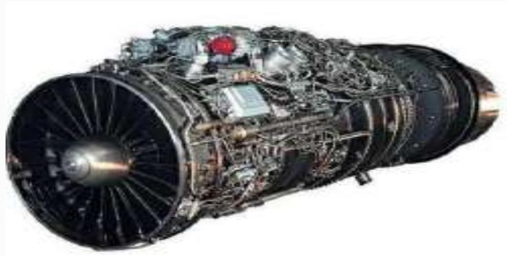

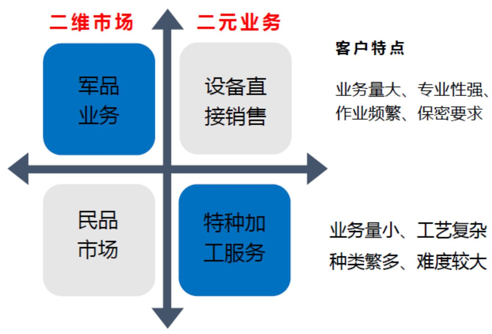

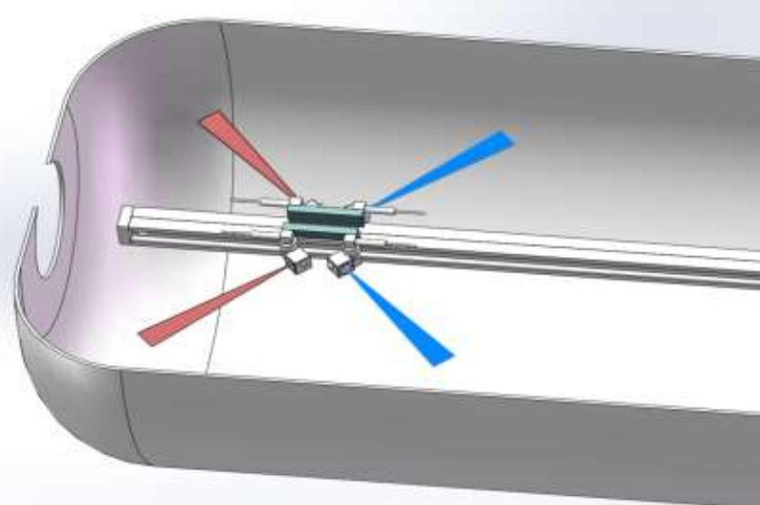

# 五、 融资计划

非接触式表面预处理，基于激光、高压水射流等高能束表面改性技术，环保、精准、高效！孵化七年进入市场，截止2023年实现盈利，近四年销售复合增长率 $80 \%$ 以上。

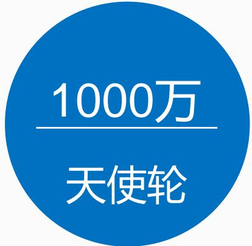

为了加快成果转化，巩固市场与技术领先地位，公司拟启动天使轮融资，采取增资扩股方式，融资1000万人民币，出让股权不超过$10 \%$ 。

本次融资全部用于生产线建设  

<table><tr><td rowspan=2 colspan=1>投资项目名称</td><td rowspan=2 colspan=1>项目建设内容</td><td rowspan=2 colspan=1>投资额</td><td rowspan=2 colspan=1>量产日期</td><td rowspan=1 colspan=2>年新增</td></tr><tr><td rowspan=1 colspan=1>营业额</td><td rowspan=1 colspan=1>利</td></tr><tr><td rowspan=1 colspan=1>航天半管双高压减重生产线建设项目</td><td rowspan=1 colspan=1>针对航天发动机半管减重，建成机器人高效作业产线，砂水循环使用</td><td rowspan=1 colspan=1>200万元</td><td rowspan=1 colspan=1>2024年10月</td><td rowspan=1 colspan=1>300万元</td><td rowspan=1 colspan=1>180万元</td></tr><tr><td rowspan=1 colspan=1>双高压叶轮流道光整清理生产线改造</td><td rowspan=1 colspan=1>针对陕鼓动力离心压缩机叶轮流道光整Ra3.2/1.6um，建成半自动产线，提高效率</td><td rowspan=1 colspan=1>100万元</td><td rowspan=1 colspan=1>2025年7月</td><td rowspan=1 colspan=1>250万元</td><td rowspan=1 colspan=1>100万元</td></tr><tr><td rowspan=1 colspan=1>《航空航天激光清理加工中心》建设项目</td><td rowspan=1 colspan=1>列入陕西光子产业链重点发展项目，财政支持资金140万元，建成叶片3D清洗、导弹内腔毛化等五条激光来料加工生产线</td><td rowspan=1 colspan=1>700万元</td><td rowspan=1 colspan=1>2025年10月</td><td rowspan=1 colspan=1>600万元</td><td rowspan=1 colspan=1>400万元</td></tr></table>