# 雷军2025年度演讲全⽂：⽐失败更可怕的，是失去重新站起来的勇⽓

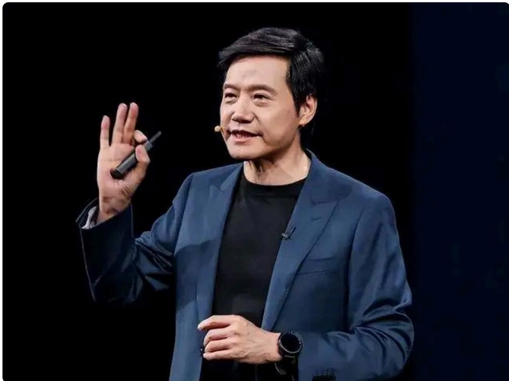  
雷军

雷军，1969年12⽉⽣于湖北仙桃，⼩⽶科技有限责任公司创始⼈、董事⻓、⾸席执⾏官，第⼗⼆、⼗三、⼗四届全国⼈⼤代表，中国⺠间商会副会⻓。2018年⼊选改⾰开放40年百名杰出⺠营企业家，2020年当选北京市劳动模范，2021年⼊选《福布斯》中国最佳CEO（第⼀名），2022年⼊选《财富》中国最具影响⼒的50位商界领袖。

在媒体圈看来，有“雷布斯”之称的雷军是最擅⻓社媒营销的中国企业家之⼀，擅⻓⽴⼈设、造热点，也会“说⼈话”，蹦出过不少⾦句：“⽣死看淡，不服就⼲”、“豁出去，⼲！”、“最好的投资，就是投资⾃⼰”、“熬过绝望低⾕，你便⽆⼈能敌”、“别畏难！先⼲起来再说！”、“⼈⽣不能后退”……

褪去营销的⾯纱，从他的话语⾥，也许能品出不⼀样的东⻄。

2025年9⽉25⽇晚间，⼩⽶科技创始⼈雷军发表年度演讲，主题为“改变”，在演讲中，雷军详细讲述了⼩⽶芯⽚和⼩⽶造⻋的故事。

以下是演讲全⽂（注：未经演讲者本⼈审阅）：

朋友们，晚上好！欢迎⼤家！

今天，是我第六次年度演讲。今年，是我们⼩⽶创办15周年。

在15周年之际，⼩⽶在汽⻋、芯⽚领域连续两次的重⼤突破，让很多⼈刮⽬相看。感觉⼩⽶好像⼀夜之间，换了⼀家公司。

其实，这些改变都来⾃于5年前那次触及灵魂深处的⼤反思。

⼀、失败本身并不可怕，正视⾃⼰内⼼的恐惧才是关键五年前（2020年），⼩⽶迎来了⾃⼰的⼗周年。那个时候的我们，上市已经两年时间，年收⼊也突破到2000亿，成功地跻身了世界500强的⾏列。

在很多⼈眼⾥，⼩⽶已经⾮常⾮常成功了。但是，在我内⼼却充满了难以⾔说的焦虑。

当时我们所处的这个⾏业，苹果、三星、华为如同⼏座⽆法逾越的⼤⼭，⼏乎看不到超越的可能性。

在这样的情况下，是躺平认命，还是继续打拼呢？

创业10年，团队中很多⼈都觉得累了，想停下来歇⼀歇。

这⼀点，其实我完全理解，因为我⾃⼰也觉得很累很累。可是转念⼀想，下⼀个⼗年竞争只会更激烈，还有多少⼈愿意继续与我并肩作战呢？更让⼈疲惫的是什么呢？是⽹上充斥着各种质疑、批评甚⾄是攻击。

说实话，我觉得不少⼈对⼩⽶真的不够了解，他们对我们有很多固有的偏⻅。

所以，⽹上经常会看到很多让你很⽣⽓的话，⽐如“⼩⽶就是⼀家组装⼚”“⼩⽶没啥技术”“⼩⽶只会营销，肯定⾛不远”等

等。

那个时候，我陷⼊了严重的内耗。挣扎了许久之后，我才下定了决⼼，直⾯所有的问题，找到破局的道路，逆天改命。

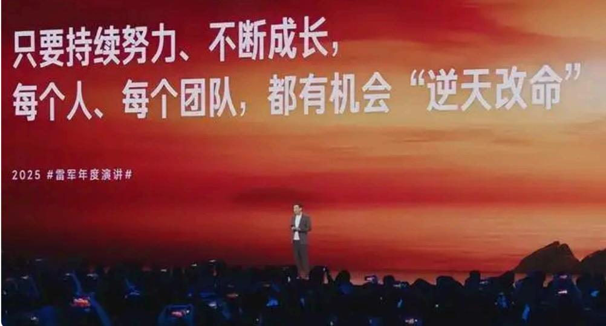

说到逆天改命，谈何容易。起初，其实我也不知道怎么⾯对这么多的问题。

今天想起来，很幸运的是，我⼩时候学过围棋，学会了⼀种⾮常有效的办法，那就是什么呢？复盘。

很多⼈对复盘可能有些误解，复盘不是总结，它回答三个⾮常⾮常关键的问题：做完这件事情以后，你做对了什么？做错了什么？如果让你重来⼀遍的话，你该怎么做？

我们就是⽤这种⽅法开始了漫⻓⽽深⼊的复盘。

每次复盘会，我⼀般会找七⼋个⼈放开了聊，往往⼀聊就是四五个⼩时。就这样，我们开了四五⼗次，⼤概持续了半年的时间。

经过这么深⼊地复盘，我们坚定了下个阶段的发展道路。

我们的道路是什么呢？就是持续地投⼊底层核⼼技术，坚定地从互联⽹公司⾛向硬核科技公司，并计划在未来的五年⾥在核⼼技术上投⼊1000个亿。

要知道，2019年⼩⽶的研发经费是75亿，所以， $\boldsymbol { \mathsf { \Omega } } ^ { \prime \prime } 5$ 年1000亿”，对于那个时候的⼩⽶是⼀个巨⼤的数字。

但正是提出了这样的⽬标，从那⼀刻起，⼩⽶的基因开始重塑，“技术为本”成为了我们永不更改的铁律。重新创业的热情被完全点燃了。

在随后的五年的时间⾥⾯，我们就是⽤创业的决⼼引进了⼤量的⼈才，并重塑了核⼼管理团队。

这个变化有多⼤呢？⼤家可以看⼀看我们今天的⾼管团队的名单：

⾸先，在我们早期的创始团队⾥⾯，还有两位，林斌和刘德与我在继续打拼；因此，在我们12位⾼管⾥⾯有9位都是新⾯孔，我们积极地引进了外部的顶尖⼈才，包括卢伟冰、曾学忠、王晓雁、林世伟、刘伟等⼀批⾼管。

这⼏位，有的是直接空降⾼管，有的是作为中层引进，⼀步⼀步成⻓为⾼管。

这些同事们为过去⼏年⼩⽶的发展做出了重⼤的贡献。

同时，我们也⾼度重视内部培养，我们提拔的⼀批年轻的⾼管，都是最早期⼩⽶⼀帮同事，他们历经⼗多年的历练和磨砺，逐渐成为了新⼀代的领军⼈物，进⼊了⼩⽶的核⼼团队。

这⾥，我就说⼀位——朱丹，他的⼯号是54号，是⼩⽶最早的⼀批⼯程师。就是朱丹组建了我们今天的芯⽚团队，⽞戒O1也是他带队攻克的。

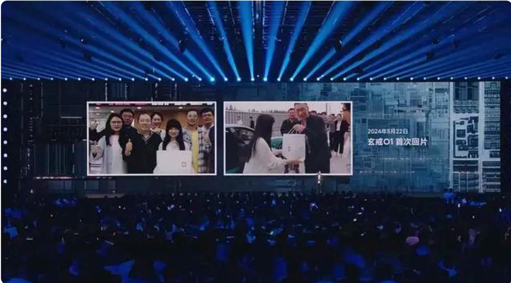

说到朱丹，我们再说说芯⽚业务的来⻰去脉。

⼩⽶⼀直有⼀颗芯⽚的梦想。早在11年前，2014年，⼩⽶刚刚创业四年，我们就全资成⽴了松果电⼦，毅然开始了⾃研Soc芯⽚。

经过三年的努⼒，2017年，我们的第⼀代终端的Soc正式发布，搭载在⼩⽶5C上，当年就卖了60万台。

这个格局看上去⾮常⾮常不错，但是我⼼⾥清楚，松果其实⾛不下去了。

2018年，我们做了⼀个艰难的决定，停掉了Soc芯⽚的研发，队伍缩编，继续做⼀些⼩芯⽚，算是保留⼀点点⽕种。

我还记得5年前那次复盘，只要聊到芯⽚话题，⼤家都特别特别痛苦，⼼有余悸。

我在想，要想解开⼤家的⼼结，我们必须搞清楚，松果到底输在哪⾥？后来，我们陆陆续续花了很多时间去研究，我们⼀步⼀步找到了当年松果是为啥输的。

所以，复盘很重要。

⾸先，有⼀个反直觉的结论，这个结论可能跟⼤家正常的理解是反着的：⾃研⼿机Soc，做中低端完全没机会；⾃研⼿机Soc，只有做最⾼端，才有⼀线⽣机。

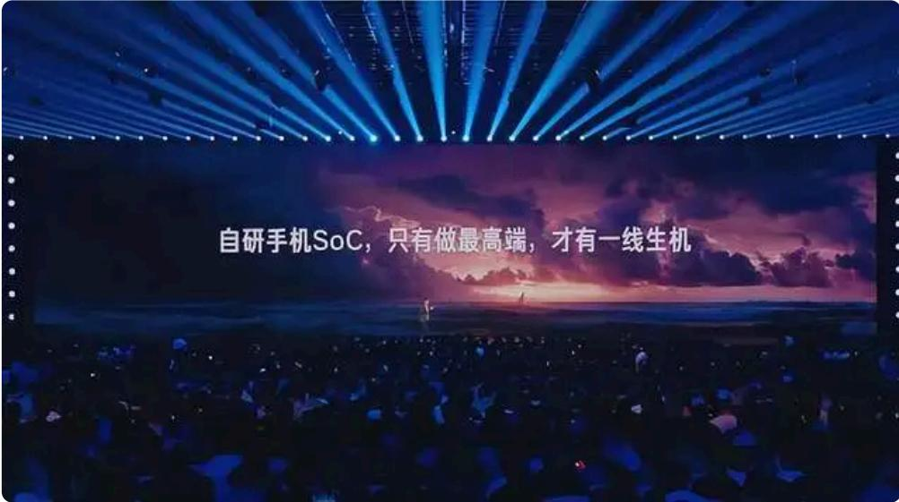

可能⼤家正常的理解是：做这么复杂的科技，肯定要从中低端做起。

可是，Soc芯⽚这个⾏业特别特别复杂，⾥⾯的原因太复杂了。我们研究以后发现，当年苹果和华为都是从最⾼端切⼊的，没有⼀个⼿机公司是从低端切⼊Soc的。

这个结论，让我们充分地意识到：松果⼀上来切⼊点找错了，⽅向错了。

接下来，⾃研芯⽚还需要⼿机团队的全⼒⽀持。

⼤家想想看，⼿机团队为什么放着成熟的外部的芯⽚不⽤，⽽要承担巨⼤的⻛险去⽤⾃研的呢？如果⾃研芯⽚有问题的话，整个⼿机业务都毁了。

在这样的⻛险情况下，如果没有完全⼀致的⽬标和荣辱与共的决⼼，这事肯定⼲不成。

⽽当时的松果我们注册的是⼦公司，在管理上相对独⽴，跟⼿机团队的协同⾮常困难，经常扯⽪。我还亲⾃下去协调了很多次，最后，我也搞不定。

就这样，松果的失败就成了必然。

但是，芯⽚是⼩⽶发展过程中绝对绕不过去的⼀个关键。全球顶尖的科技巨头，最终⼏乎都成了芯⽚的巨头。

所以，我⼼⾥很清楚——芯⽚是⼩⽶⾛向成功的必由之路。

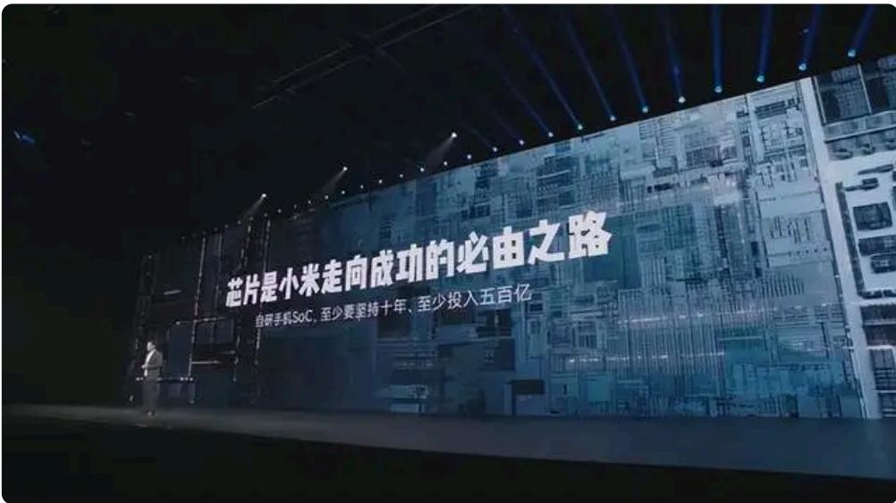

如今，造芯的复杂度已经远超了10年前。现在再做⼿机Soc，⾄少要花10年时间，500亿。

花这么⻓的时间，花这么多钱。就⼀定能成功吗？万⼀不成，我们⼜该怎么办呢？

这个讨论过程持续了很久，⼤家⼼⾥⼀直没底，也下不了决⼼。

讨论到后来，我⿎励⼤家：不⼲，我们肯定是输；要不我们试试？不试怎么知道我们就不⾏呢？

可能就是在最关键时候的这⼀点点的勇⽓，我们在2021年年初新⼀轮的芯⽚之旅就重新开始启动。

所以，往往就是在最要紧的时候，如果你有那么⼀点点勇⽓，这⼀步就迈出去了。

当然，“松果”失败的阴影依然笼罩在很多⼈⼼⾥，以⾄于我们⻅到每⼀位合作伙伴，都要拼了命地去解释，去说明。

我们费尽了周折，才重新组建了团队。

项⽬进⼊了第⼆年，没想到我们遇到了更⼤的困难。当时受国际经济形势影响，受地缘政治的影响，⼩⽶的业务遇到了巨⼤的挑战，营收⼤幅下滑，骤减了 $1 5 \%$ ，第⼆年继续下降了$3 \%$ 。

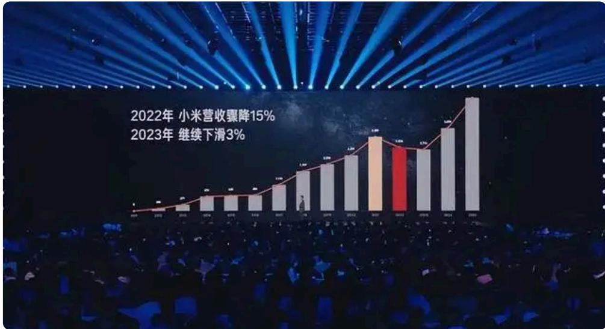

这在⼩⽶15年的发展的历程上，是第⼀次。哪怕在2015年-2016年我们最困难的时候，业务都没有下滑过。

⽽此时，造⻋、芯⽚，每个项⽬都需要五六百亿的投⼊。这个压⼒令⼈窒息！

就在这个时候，团队⾥出现了⼀些质疑的声⾳。

这个质疑的声⾳是什么呢？继续⼲芯⽚，会不会把公司拖垮？我们内部的⼠⽓有些动摇。

就在这个最关键的时候，2022年5⽉，我们专⻔组织了⼀次⾼管会，⼤家坐在⼀起认真地讨论了⼀下，因为我希望所有的决定是我们所有⾼管⼀致的意⻅。

这个会议的⽓氛⾮常⾮常凝重，每个⼈知道这个决定对⼩⽶来说都是⼀个重⼤的决定。

当然，⼤家也知道这个决定⾮常难下，因为如果我们这⼀次再放弃的话，⼩⽶可能永远与芯⽚⽆缘。因为我们连续放弃两次，市场不会再相信我们，也不会再给我们机会。

最后，有位⾼管坦⾔：从商业⻆度来看，这笔账此时此刻根本算不清楚，只能靠创始⼈来判断。

我没有丝毫的迟疑，当即问了⼤家⼀个问题：假如现在放弃，10年后我们是会为公司的账上多了⼏百个亿⽽庆幸？还是会为⼩⽶这家公司永远失去芯⽚业务⽽后悔？

在会上的我，明确表达了⾃⼰的观点：我坚决⽀持⼲，我认为这⼏百个亿的投⼊绝对是值得的。退⼀万步，最终我们没有成功，也将为⼩⽶培养⼀⽀强⼤的芯⽚研发队伍，也将彻底地改变这家公司的质地。

经过充分的讨论，⼤家坚定了信⼼。

项⽬进⼊第三年，2023年5⽉，芯⽚⾏业突发了⼀场地震：⼀家同⾏没有任何预兆，3000多⼈的芯⽚团队就地解散。

我的⼿机瞬间被电话信息挤爆，很多⼈来问：⼩⽶芯⽚团队会不会也要解散？

当时，我确实有点懵，不知道发⽣了什么。当然，我们⼲过松果，我知道⾃研Soc有多难，绝对是九死⼀⽣。

对我们⼩⽶来说，我们已经输过⼀次了，这⼀次咬着⽛也要坚决⼲下去！

因为市场上的传⾔很多，为稳定军⼼，我要求朱丹开⼀个芯⽚团队的全员会。会议通知刚刚发出去，芯⽚的同事们吓了⼀跳，以为我们也要解散。在会上，朱丹传达了公司的决定后，⼤家⻓舒了⼀⼝⽓，下定决⼼⼀定要把芯⽚⼲成。

2024年年初，芯⽚按计划投⽚。我们采⽤最先进的3纳⽶⼯艺，仅投⽚费⽤就⼤约需要2000万美元。去年5⽉22⽇，第⼀⽚芯⽚样品回来了，⼤家⾮常⾮常激动，集体到机场迎接。

那天，我在外地出差，每隔⼏分钟就查看群⾥的信息，焦急等待着最后的结果。⼤家也都⾮常紧张，假如不成功那么2000多万美元就会打⽔漂，更甚者可能整个项⽬都会推迟6个⽉，损失⾄少有11\~20亿。

幸运的是当晚9点，系统终于点亮。第⼆天⼀⼤早，我接到了朱丹⽤⽞戒O1打来的电话，这意味着所有模块都调通，3纳⽶旗舰芯⽚如此复杂，⼀次投⽚（“投⽚”是芯⽚产业中连接“设计”与“制造”的关键环节，核⼼指芯⽚设计⽅在完成全部设计与验证后，将最终设计数据正式交付给晶圆代⼯⼚，启动芯⽚⽣产流程的操作）就能成功，SPK0我们的团队确实⽐较⽜。

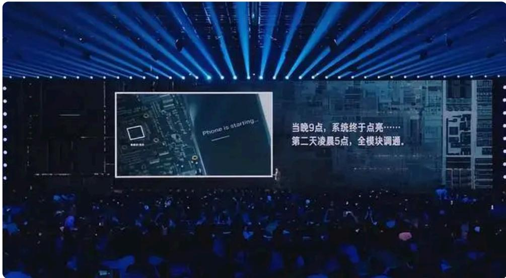

那⼀刻，我们百感交集。

今年5⽉22号，⽞戒O1和搭载这颗芯⽚的⼿机正式发布。谁也没有想到⼩⽶的第⼀款旗舰Soc表现⾮常出⾊，进⼊了整个市场的第⼀阵营⽔平。

如今，这款⼿机已经上市四个⽉，⼤家对我们的反馈就是，和其他的芯⽚⽐起来没啥不同。这其实是对我们很⾼的评价。

我觉得这4年多的努⼒对我们⽽⾔，不仅仅是技术的问题，最难的是经历松果的惨败后，如何⿎起勇⽓重新站起来重启这个项⽬。我觉得失败本身并不可怕，正视⾃⼰内⼼的恐惧才是关键。

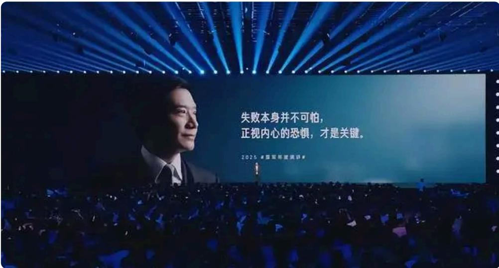

如何克服恐惧？把这件事情重新再做⼀遍。我觉得这是很难的⼀件事情。

当然，⽞戒O1的成功只是第⼀步，它离最终的成功还有很远的路要⾛。我⾮常希望⼤家能⽀持我们，我们会努⼒坚持做下去，直到成功的那⼀天。

聊到这⾥，我想分享⼀个⼩细节。项⽬刚启动时，我建议继续叫松果，我们在哪⾥摔倒就在哪⾥爬起来。但我真的没想到，⼤家坚决不同意。

后来我们只好起了⼀个新的名字叫⽞戒，这个名字的含义很简单，代表了⼀个庄重的承诺——⼩⽶造芯，这⼀次我们是认真的。

# ⼆、只有发⾃内⼼的热爱和向往，才能创造奇迹

接下来我们聊⼀聊⼩⽶汽⻋征战纽北的故事。

今年6⽉，⼩⽶宣布了⼏项特别炸裂的消息，即⼩⽶SU7 Ultra原型⻋在纽北官⽅的圈速榜总榜上排名第三，Ultra的量产⻋位居全球量产电动⻋的榜⾸，这个消息迅速震撼了全球的汽⻋⼯业。

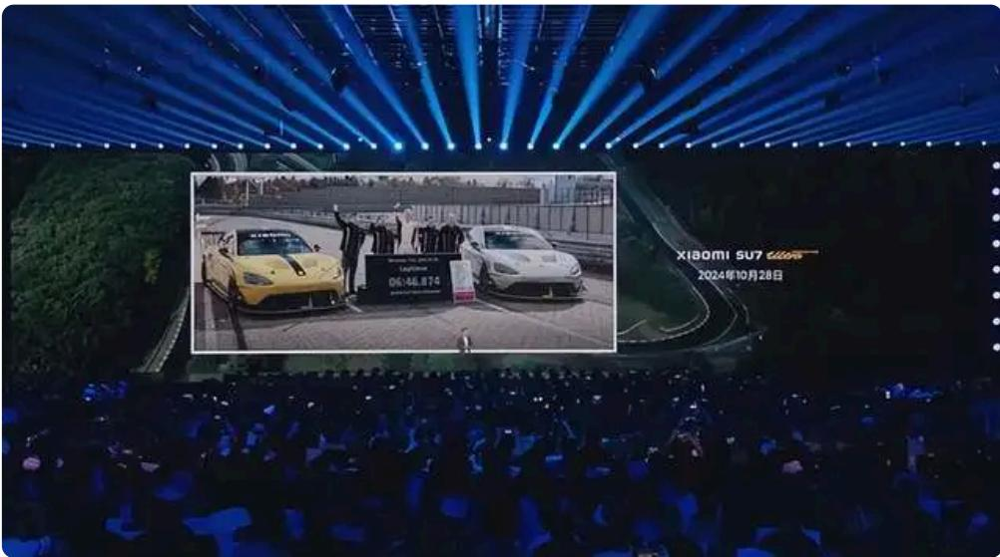

很多⼈都很好奇，⼩⽶这家⼿机公司造⻋，怎么也只能算汽⻋⾏业的新兵蛋⼦吧？怎么这么⽣猛？故事要从4年前讲起。

先向⼤家介绍⼀个⼈，阿灿，相信很多⽶粉朋友们都⽐较了解，他是⼩⽶⾸席测试⻋⼿和动态性能⼯程负责⼈。他出⽣在浙江诸暨，他⽼家附近有⼀个修⻋⼚，他童年就在这个修⻋⼚⾥⻓⼤，修⻋⼚的⼯具就是他的玩具。

在上⼤学时，他每天都在汽⻋论坛上⼯作，毕业后成为了汽⻋底盘⼯程师。为了把底盘做好，他业余时间学习赛⻋，苦练技术，最终获得了许多赛⻋冠军。由此可⻅，阿灿对汽⻋到了什么样的痴迷程度。

4年前⼩⽶宣布造⻋，满屏弹幕都是特斯拉的照⽚。他和⼀群朋友观看我们的发布会，热⾎沸腾。后来他的⼀位同事准备加⼊⼩⽶，他⻢上询问兄弟能否带我⼀起去。为了表决⼼，他甚⾄表示⽆论⼩⽶汽⻋在哪⾥制造，他都会举家搬到那⾥去。

就这样，⼩⽶聚集了⼀群热爱汽⻋且充满活⼒的⼯程师，他们都渴望在⼩⽶平台上取得⼀些惊天动地的成果。请⼤家想⼀想，当我们聚集了众多优秀⼯程师时，我们会⼲出什么样的事情来？

2021年9⽉，⼩⽶汽⻋⾸次全员会上公布了⼀个宏⼤计划，即打造全球最强的纯电性能⻋。⼩⽶SU7最初制⻋时就提出了夸张的⽬标，我回想起来都是初⽣⽜犊不怕⻁。

要做全球最强，困难⾮常多。举个例⼦，当时市场上没有合适的⾼性能电机，我们这个项⽬不做了吗？我们咬⽛⼀跺脚，⾃⼰组团队⾃⼰⼲。这就是我们后来的⼩⽶V8S超级电机，这个电机甚⾄是在我们⾃⼰的⼯⼚制造，连代⼯⼚都没有使⽤。

你们知道原因吗？因为我只要使⽤了代⼯⼚，他⼜说这个技术是供应商技术，真的很⽓死，这下⼤家明⽩了为什么这次V8S电机我⼀定要⾃⼰⽣产。

经过⼏个⽉的认证后ultra项⽬正式⽴项，但紧接着春节刚过，项⽬被取消。我不知道⼤家是否记得2022年春节后，我们召开了⼀次⻓会。在那个时间点，SU7的研发到了最关键的时候，我们的资源和能⼒严重不⾜。

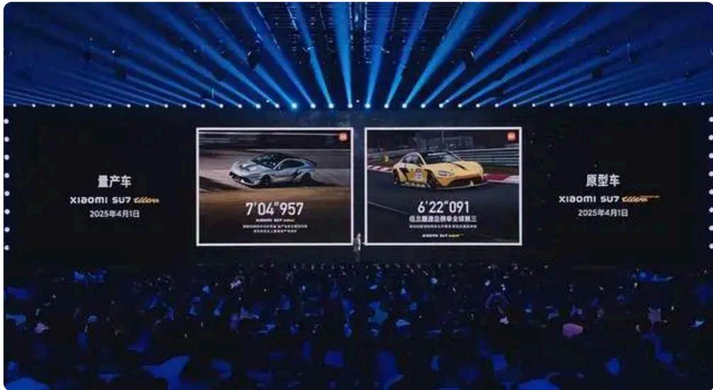

当时我们⾮常痛苦，下决⼼聚焦最关键的项⽬，为了确保SU7的成功，最后⼤家咬紧⽛关，忍痛将Ultra取消。取消完以后，⼤家沉默了很久，都挺沮丧。谁也没想到，过了3个⽉⼜反转，Ultra被我们捞回来了。

我记得5⽉份的时候，那次会议我们在线上开了好⼏天。为了让⼤家轻松⼀点，活跃会议⽓氛，我刻意给参加会议的每位同事家⾥寄了⼀瓶红酒，我们喝着酒开线上会。

有⼀个⼯程师喝嗨了，举着酒杯提议：保时捷是我⼼中的神，我们能否制造⼀辆⻋在纽北上⼲翻保时捷？

实话实说，当这个疯狂的想法⼀提出来，瞬间点燃了全场。⼤家想⼀想，对⼀个汽⻋⼯程师来说有多嗨，开着亲⼿打造的⻋，在纽北赛道上驰骋，然后超越保时捷。

所以，当时⼤家特别特别激动，SU7项⽬已经取得阶段性突破，压⼒不⼤，因此决定重启Ultra项⽬。消息公布之后整个⼯程团队沸腾。阿灿本⼈激动地跳了起来。在我们这样⼀家疯狂的公司，⽆论遇到多少困难，我们都想把AIoT项⽬做成。Alpha是⼀群⼯程师的追梦之旅。

在做出决定后，⼤家热⽕朝天地投⼊⼯作。然⽽，在如此复杂的项⽬中，困难接踵⽽⾄。我不想在这⾥详细讲述那些困难的情况，只是向⼤家提出最想不到的困难。

2023年8⽉，当项⽬进展到⼀个阶段时，我们⾸次联系纽北官⽅。对⽅⾮常客⽓，很快回复了。但是⼤家没想到，之后再⽆⾳讯，我们连续发了20多封邮件，都⽯沉⼤海。虽然我们想要挑战纽北，但是他们根本不理会我们。直到三个多⽉后的圣诞节前夕，我们才收到第⼆封邮件。他们终于答应接待我们。

元旦过后，我们项⽬组的同事⽴刻赶往纽北。那天⼤雪纷⻜，我们⻅⾯后才了解原因。对⽅提出的第⼀个问题是为什么要抓纽北，他们不明⽩。实际上纽北官⽅⾮常客⽓，接待我们也⾮常热情，他们以为我们在开玩笑。

当我们详细介绍了计划和Ultra项⽬时，⼩⽶的雄⼼终于打动了他们。虽然赛道档期⾮常紧张，但是纽北官⽅在为我们尽⼒争取。我们是在1⽉初申请档期，⼀排排到了10⽉初。许多⼈可能不了解纽北档期有多紧张。

冬季时，纽北有5个⽉封⼭期，平时还有各种⽐赛和⽤户活动。全球最好的⻋⼚和零部件⼚都在那⾥测试和包场。

⼤家都知道纽北的档期有多紧张。为了保证⾜够的时间拿出好成绩，我们当时决定连续两天包场，分别是10⽉9号和10⽉10号。我们做了充⾜的准备，期待着Ultra的精彩表现。

没想到10⽉9号全天下⾬，⼤家的情绪特别低落。看到天⽓预报，第⼆天应该还有机会，所以⼤家依然在相互⿎励。为了⻅证这个重要的时刻，10号⼀⼤早我匆匆忙忙赶到纽北，从早晨凌晨7:00开始⾛到赛道边，结果看到⼀天⾬。

⼜下了⼀天，我们费尽⼼机争取，在去年⼀年争取了这两天时间，却全部泡汤。

⼤家理解，跑纽北赛道的第⼆个困难是天⽓，这是靠天吃饭的机会。后来我们争取了各种机会，联系纽北官⽅和全球⻋⼚的同⾏们。

经过⼀波5折，我们在10⽉28⽇终于获得了跑⼀圈的机会，仅⽤10分钟就可以完成。这⼀圈的机会使Ultra原型⻋创下了纪录，让世界⾸次⻅证了⼩⽶汽⻋的实⼒。

回想项⽬，我深感如果不是⼯程师发⾃内⼼的热爱和向往，或者我们始终坚持不放弃，⼩⽶绝不可能诞⽣这样的奇迹。

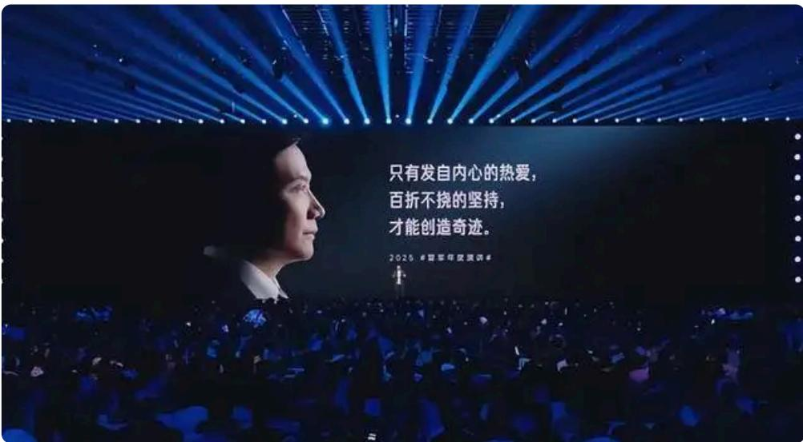

每次看到去年仅⼀圈的机会就能创造世界纪录，这让我⽆⽐感慨。今年的4⽉1⽇，ultra量产⻋正式冲击纽北。这次天⽓很好，我们仅仅跑了4圈就留下了两项震撼⼈⼼的成绩，只跑了4圈，留下了两辆⻋震撼⼈⼼的成绩。

回顾过去三年，我们经历了诸多挫折，但最终结果远超预期。⽹上有句话⾮常好，我⾮常喜欢。今天特意分享给⼤家：你只需努⼒，其他交给天意。

唯⼀遗憾的是阿灿。去年10⽉为了确保成功，他将这次唯⼀⼀圈的机会让给纽北的本地⻋⼿David。今年他个⼈没有跑出理想的圈数。⽬前，纽北官⽅的圈速榜上没有任何⼀个中国⻋⼿的名字。但他相信，终有⼀天，他会在纽北官⽅圈速榜上写下⾃⼰的名字。

凭实⼒赢得尊重，⼩⽶在纽北的⼀系列的成绩，正悄然改变着全球汽⻋⼯业对中国汽⻋的印象。

SU7系列⾸战就获得了世⼈瞩⽬的成绩。有哪些成绩呢？我简单跟⼤家数数。

SU7成为了过去⼀年20万以上最畅销的轿⻋（包括油⻋在内），成为了所有⻋型的销量排⾏榜第⼋名（包含⼏万块钱的⻋型），⽽且登顶了保值率的榜⾸，它是最保值的⻋。

三、遭遇难题，不妨换个思路。⼤胆去尝试，就会有不⼀样的结果

今年6⽉份YU7发布，取得了更为惊⼈的成绩：三分钟⼤定就超过了20万辆，这个数字震撼了整个汽⻋⾏业，甚⾄因为太过惊⼈，引来了⽆数的质疑。于是，我们在第⼆天下午4点就直接公布了锁单数量——18个⼩时锁单量超过了24万辆。

那么，YU7为什么能获得这么巨⼤的成功呢？

今天呢，我想给⼤家讲讲背后的故事。

可能很多⼈不了解，YU7项⽬刚开始的时候，就背负了巨⼤的压⼒。

2022年夏天，SU7正在开发的最关键的时候，SU7是⼀款纯电轿⻋，除了特斯拉以外，还没有过任何⼀辆纯电轿⻋能卖得动。

所以，在那个时间点，⼏乎所有⼈都不看好SU7。假如SU7不成功，YU7就是我们最后的底牌，它必须肩负着为⼩⽶汽⻋⼒挽狂澜的使命。所以，我们内部对YU7寄予了很⾼的期待。

⽽正在那个时间点，国内有⼀家同⾏做得特别成功。那个时间点，理想L9发布，彩电、冰箱、⼤沙发的设计获得了现象级的成功，理想开创了⼤空间增程SUV的新赛道。

YU7作为⼩⽶汽⻋的最后的底牌，我们该怎么⼲呢？是⾛⾃⼰的路，还是和⼤家⼀样抄作业？

这可能是⼩⽶汽⻋创办以来最激烈的争论，在会议室⾥⽕药味很浓。

吵到最后，⼤家不得不制定了⼀个君⼦协议：实在吵不下去了，相互拉⿊24⼩时，冷静⼀天以后再接着吵。（真的在微信⾥拉⿊24⼩时，是不是有点像幼⼉园的⼩朋友？）

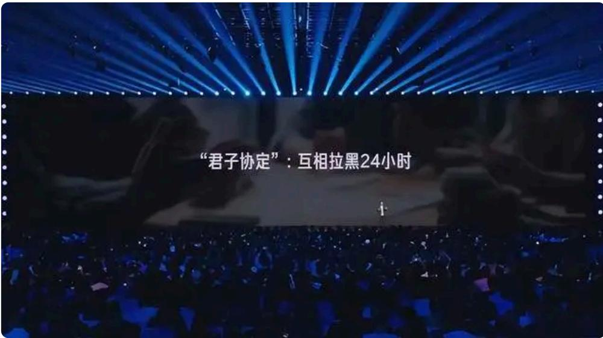

吵着吵着，⼤家的观点就清楚了：理想这类⼤空间的SUV，各家⻋⼚⼀哄⽽上，很快就会有⼏⼗款⻋上市，市场竞争会⾮常激烈，⽽且多孩的家庭也没那么多。

市场需求的总量是有限的，如果我们也做⼀款同样的⻋，肯定没前途。⽽且我们和⼤量的⽤户交流以后发现，哪怕是买了⼀辆SUV，在⼤多数时候仍然是⼀个⼈开。

最后，我们有了⼀个⼤胆的想法，我们决定⾛⼀条不同的路：为驾驶者设计，做⼀辆好看好开的SUV，兼顾家庭的⽇常使⽤

⼀款运动型SUV。

但运动型SUV在⼤众⻋型市场上很少有成功的，⼀般只有豪⻋敢⼲，因为也⾮常冒险。

所以，在论证的过程中有同事就⾮常担⼼，他担⼼什么呢？国内市场这么卷，SUV不拼超⼤空间卖得动吗？

实话实说，这是个路线选择，做超⼤空间的技术难度也没有那么⾼，但是要做⼀款运动型SUV，其实蛮不容易的。

我们的团队花了很多的时间，反复地推敲设计⽅案，最后我们⽤设计⽅案证明，我们的内部空间绝不亚于MODEL Y，这个空间对家庭⽤户来说肯定是够⽤的。

就这样，我们才下定了决⼼，YU7才正式⽴了项。

所以，从第⼀天开始，YU7就带着破釜沉⾈的决⼼，投⼊巨⼤，我们⼒求把每⼀个细节都⼲到完美。

在这个项⽬上，我们⾮常⾮常地疯狂。我举⼀个⼩例⼦：我们原来规划的标准版CLTC续航是620公⾥，对⼀款纯电SUV来说已经很不错了，也⽐MODEL Y好不少。

去年年底⼏次⻓途实测，我参加了2次，北京到上海有1300公⾥，早晨9点出发，晚上9点到，我连续开了两整天，开下来以后，⼤家都觉得还是不太够。因为很多⽤户买SUV就是为了⻓途旅⾏，我们⼀定要彻底消除⽤户的⾥程焦虑。

但是，到了去年年底的时候，想要⼤改进已经来不及了。

咋办呢？我们想了⼀个最简单、最直接、最粗暴的⽅法，就是把这个版本⼲掉，把835公⾥的⻓续航Pro版直接改名字叫标准版，⽽且定价不变，这相当于在标准版上的续航增加了215公⾥。

这个⽅案⼀提出来，采购的同学们差点哭晕在厕所。当这个⽅案放到我的桌⼦上，实话实说，跟MODEL Y⼀⽐，这竞争⼒实在是太强。

当然，MODEL Y真的是⼀辆很出⾊的⻋。今年年初，我们买了3辆MODEL Y，⼀个⼀个零部件拆，⼀个⼀个零部件学，我觉得 MODEL Y真的是⼀辆好⻋。

正是这些⽤户的⽀持，整个新能源汽⻋的发展才会越来越强⼤。

在发布会上，我反复地强调，这个标准版不是⼊⻔版，不是丐版，更不是阉割版，它相当于别⼈家的Pro版、Max版、Ultra版，因为这个标准版就是我们以前规划的⻓续航Pro版。

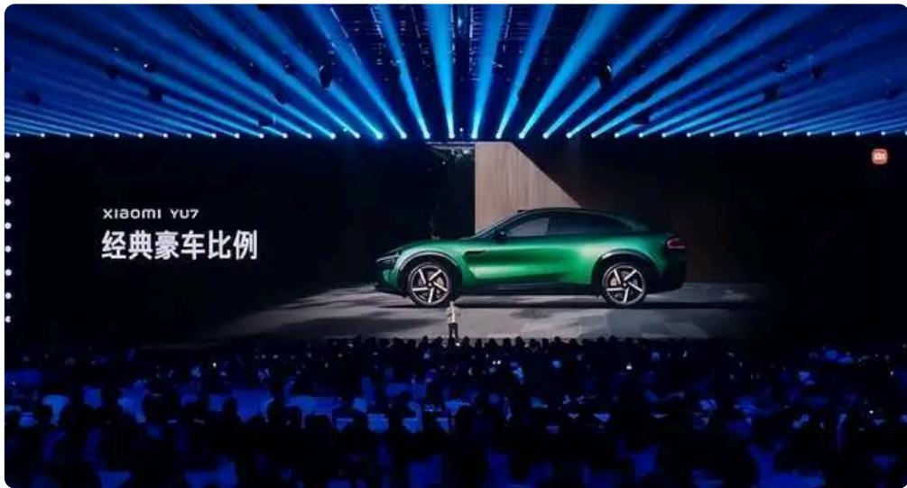

我们就是⽤了这么⼤的决⼼来把这辆⻋做好。

SU7发布会前，我请教了很多媒体的朋友们，⼀共有23位，其中21位都不看好。这⼀次YU7发布，我⼜问了很多媒体朋友们的意⻅。

你们知道他们的意⻅吗？他们都⾮常看好，反⽽我压⼒更⼤了——这款不⼀样的SUV，真的能被⼤家接受吗？

我们的内⼼依然有点忐忑，但我坚信，我们为YU7倾注的⽆数⼼⾎，⼀定会赢得很多⼈的共鸣。

所以，在YU7的发布会结尾的时候，我说了⼀段话：

YU7是为那些⽆法容忍平庸的⼈，那些始终⾛在时代前列的⼈，也是为那些双肩扛着责任、内⼼仍有远⽅的⼈，那些清晨送孩⼦上学、顺路也给⾃⼰买束花的妈妈，那些周末带着全家去露营、也在后备箱⾥为⾃⼰备⼀套钓具的爸爸，那些在柴⽶油盐的烟⽕⽓中内⼼仍有星⾠⼤海的⼈所设计的。

我特别想说，⼩⽶YU7，就是我们⼩⽶⼯程师们写给所有热爱⽣活的⼈⼀封最深情、最硬核的情书。

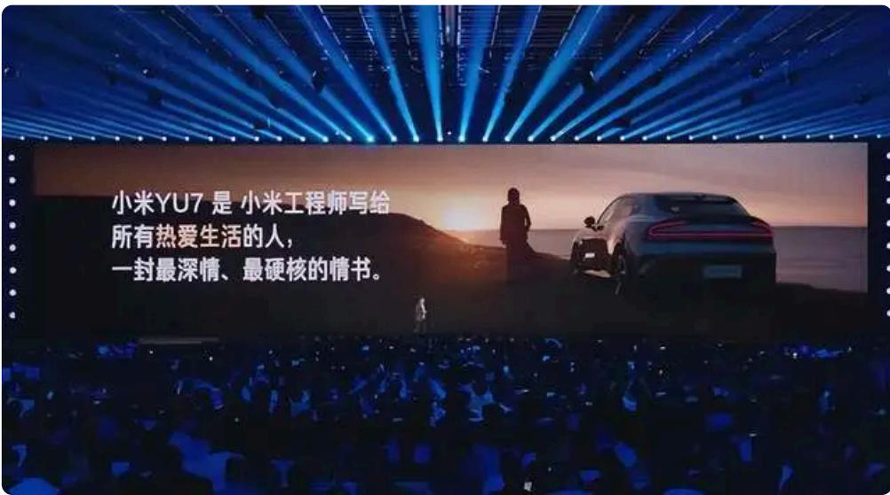

YU7⼀上市有这样的结果，是我们三年前⼤胆冒险的决策，是我们过去三年所有的努⼒。

这⾥，我想跟⼤家说⼀说⼀位YU7⻋主跟我讲的故事：

他们家宝宝出⽣以后，他就成为了别⼈。有⼀天晚上下班，他突然感到很失落，独⾃在⻋上待了半个⼩时。在忙碌的⼯作与幸福的家庭⽣活中，他好像慢慢地失去了⾃⼰。

⼀年多来，他为每⼀位家⼈都费尽了⼼⼒，唯独没有给⾃⼰买过任何⼀件东⻄，哪怕⼀件t恤。他看完YU7的发布会，被深深地打动了，当晚就说服了家⼈给⾃⼰买了⼀辆YU7。

也许YU7的奇迹就来⾃于这⾥，从最后的底牌到全新的奇迹。

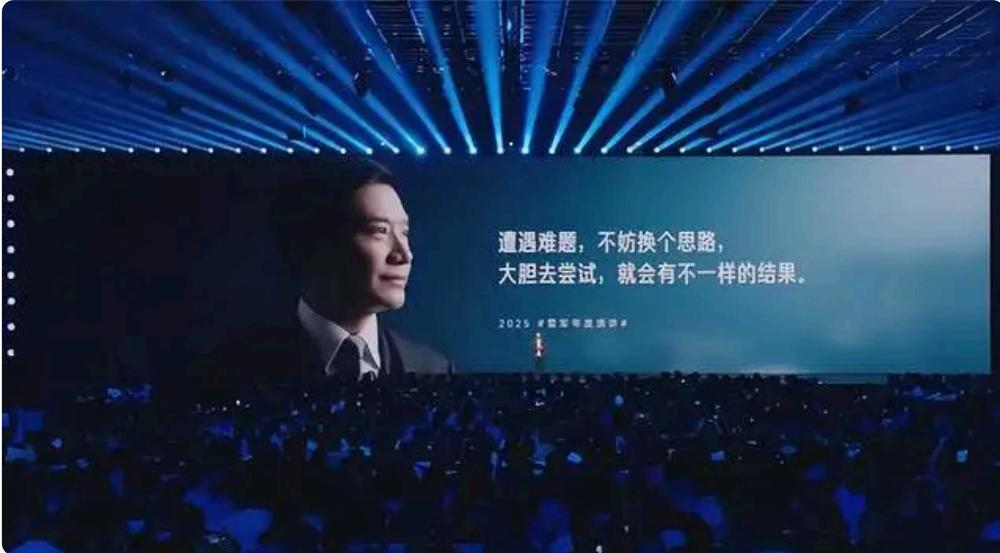

YU7给我们的启示是什么呢？是当你遇到困难的时候，不妨换个思路，⼤胆地去试⼀试，就会有不同的结果。

从SU7到SU7 Ultra，再到YU7，⼩⽶汽⻋⽤⼀系列扎实的成绩改变了⼤家对⼀家⼿机公司造⻋的质疑。同时，中国的汽⻋⾏业也正在经历巨⼤的改变。在⾼端汽⻋市场上，国产汽⻋已全⾯崛起。

四、只要持续努⼒，不断成⻓，每个⼈都有机会“逆天改命”

近年来，⼩⽶所经历的深刻改变悄然引起许多⼈的关注。⽐如我的好朋友陈年，他是凡客创始⼈，经常在我的直播间蹭流量，号称榜⼀⼤哥。

去年⼩⽶SU7的发布会是我在造⻋三年交出的第⼀份答卷。这对我⾮常重要，我特意邀请陈年参加。他说⾃⼰来不了，正在⼤连写⼩说，已经闭关⼀年多时间，除了偶尔出去吃饭外，⼏乎不出⻔。我听完之后确实有些惊讶，也确实有⼀段时间没有⻅到他。

他告诉我，凡客当年创业时亏损很⼤，最后⽋了10多亿。在之后的⼗⼏年⾥，每天早晨起床第⼀想的就是还债，这样还了整整10年时间。在3年前终于全部还清。

在还清的那⼀刻，他彻底累了。当他告诉我的时候，那⼀瞬间我都不知道该说什么，也不知道怎么安慰他，只能说我懂。

没想到SU7发布会那天，他还是来了。SU7的发布会⾮常成功，当晚不少朋友⼀起聚餐，⽓氛⾮常热烈，唯独他格外安静，没怎么说话。

半年后陈年突然邀请我们⻅⾯，我们约定的是第⼆天晚上9点。⻅⾯后我才知道他特意从杭州乘坐⽕⻋赶来。我⼀直没有反应过来，他在⼤连写⼩说，书写得怎么样了？

这时他才告诉我，去年3⽉份看完SU7的发布会后，他受到很⼤触动，4⽉份他把公司全部搬到杭州，⾃⼰带队全⾯转型直播电商。

我随⼝问了⼀句，整个公司搬迁到杭州，动静很⼤，搬了多少⼈？他说三四个⼈。我突然理解了他当时的状态，曾经1万多⼈的凡客，实际上已经归零。

我印象中的陈年书⽣⽓很重，我有些为他担⼼，他能够胜任直播电商吗？何况陈年兄弟这个年纪，还能从零开始吗？

他很有信⼼地告诉我，在su7发布的那个晚上，⼼中沉寂很久的东⻄突然被点燃了。他说雷军可以改变⾃⼰，跨⾏造⻋，我也可以。

在那个刹那，我脑⼦⾥⽴刻冒出这样的⼀句话：果然，55岁，正是闯的年纪。

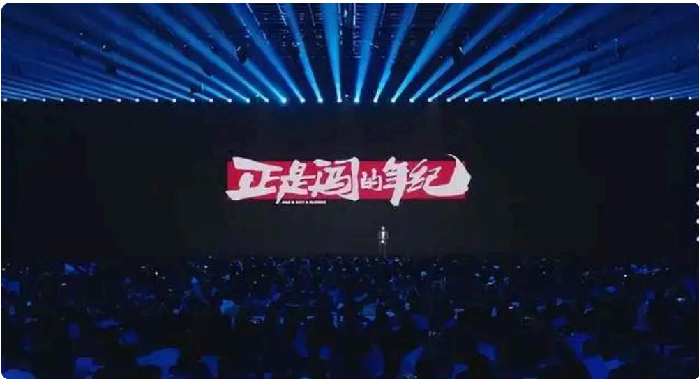

今年年初他⼜来找我。他⾮常⾼兴地告诉我，凡客已经做到抖⾳男装前三，据说还经常排到第⼀位，这个我没核实过。凡客公司⾮常发达，听说有好⼏百号⼈。陈年，这位我认识了28年的朋友，这次我真⼼佩服。

过去的5年，⽆论是对⼩⽶还是对我个⼈，都是⼀场彻底的蜕变。我们从⼀家互联⽹公司坚定地迈向了智能制造的新战场，从⼿机和消费电⼦出发，开创了⼈⻋家全⽣态的新局⾯。

这⼀路的改变远不⽌于造⻋、芯⽚和⾼端化，更重要的是我们⽤5年脚踏实地的努⼒，重塑了⼩⽶的⻣骼与灵魂。

5年来，我最⼤的感受是从迷茫到蜕变，有时候隔着千⼭万⽔，有时候只隔着⼀层窗户纸，只要持续努⼒，不断成⻓，每个⼈和每个团队都有机会逆天改命。

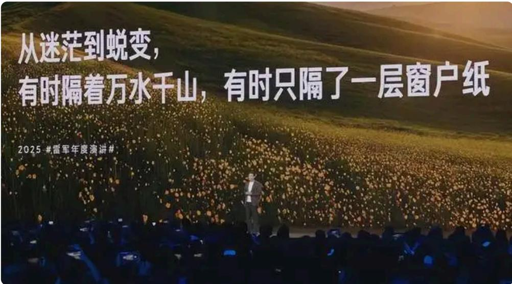

谢谢⼤家，今天的演讲到此结束。

免责声明：本内容来⾃腾讯平台创作者，不代表腾讯新闻或腾讯⽹的观点 $\textcircled{1}$ 举和⽴场。 报