# 雷军年度演讲全⽂：⼩⽶造⻋，勇⽓从何⽽来，⼜如何冲出重围？

原创 赞 47 收藏 50 评论 9

举报 2024-07-20

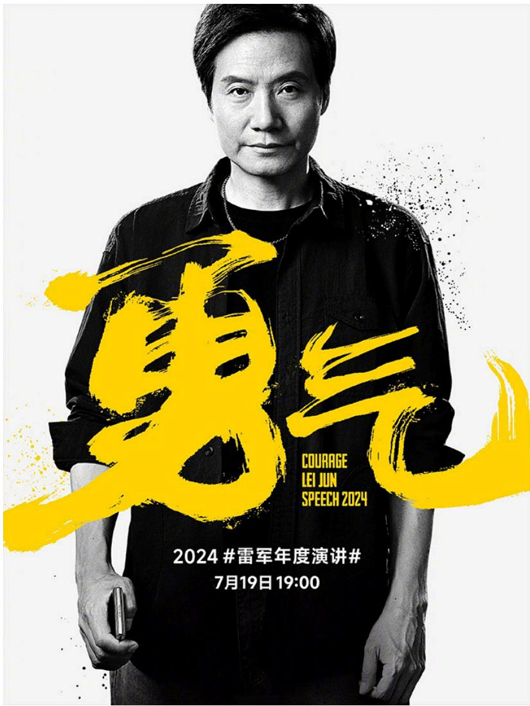  
作者，雷军，⾸发：⼩⽶

2024年7⽉19⽇晚上19:00，我的第五次年度演讲「勇⽓」在北京⾸钢冰球馆举⾏。

在3⼩时的演讲和年度新品发布中，我分享了⼩⽶造⻋的来⻰去脉，以及过去3年跌宕起伏的故事。演讲后的发布会环节，我为⼤家带来了⼩⽶MIX Fold 4、⼩⽶MIX Flip、Redmi K70⾄尊版、Xiaomi Buds 5、⼩⽶⼿环9、Xiaomi Watch S4 Sport等⼀系列新产品。最后，我发布了为赛道⽽⽣的巅峰性能纯电轿⻋⸺⼩⽶SU7 Ultra 原型⻋。⼩⽶SU7 Ultra原型⻋将在今年10⽉，正式挑战纽博格林赛道北环赛道。

过去的3年，对⼩⽶来说是⼀段脱胎换⻣的经历。⼩⽶SU7 成功的背后，凝聚着巨⼤的勇⽓，那不是某⼀个⼈的勇⽓，⽽是⼩⽶集团40000多⼈共同的勇⽓。正是这样的勇⽓，我们拥有了⽆⽐坚定的信念，要为⽶粉朋友们做辆 Dream Car，感谢勇⽓，也感谢所有⽶粉的⼀路⽀持！也祝福所有⼈：愿你永远拥有披荆斩棘的勇⽓和勇往直前的信⼼！

以下是这次公开演讲全⽂，与你分享。

⼤家好！今天是我的第5次年度演讲，欢迎⼤家！

3⽉28⽇，⼩⽶SU7 正式发布，热度远超想像，⼀夜之间成为了现象级的爆品。三个多⽉以来，我每天都像在梦⾥⼀样。回顾过去，1000多个⽇⽇夜夜，⼩⽶汽⻋发⽣了太多跌宕起伏的故事。

# ⼀ 破釜沉⾈

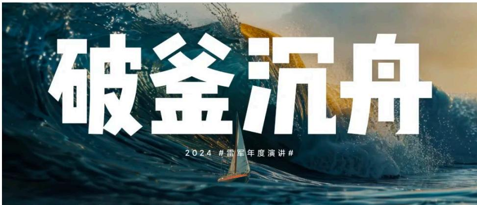

⼩⽶造⻋源于⼀个意外。

# 1.1 造⻋的起点

那是2021年1⽉15⽇，那天早上7点多，我突然接到⼀位朋友的电话，他说，“雷总，你们被美国制裁了。”这个消息有如晴天霹雳，我们召开了紧急的董事会，商量如何应对。

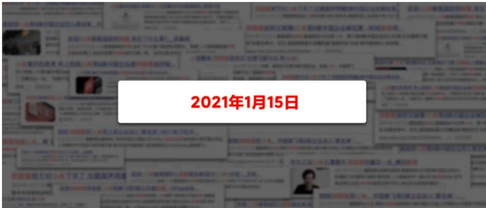

会上，有董事问，假如⼿机不能造了，你们三四万⼈该怎么办？是不是考虑⼀下去造⻋呢？

当天下午，我们第⼀次正式讨论造⻋，⼏乎所有⾼管都⽀持，但我认为⻛险太⼤，我们还是先做个调研。

# 1.2 特种兵调研

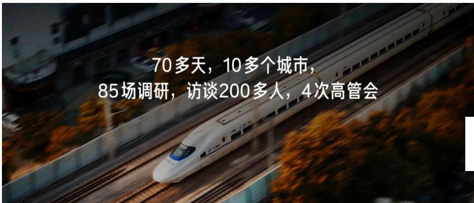

雷军年度演讲全文：小米造车，勇气从何而来，又如何冲出重围？ - 数英

我们组建了6⼈调研组，在70多天⾥，⻢不停蹄去了10多个城市，访谈了85场200多⼈。

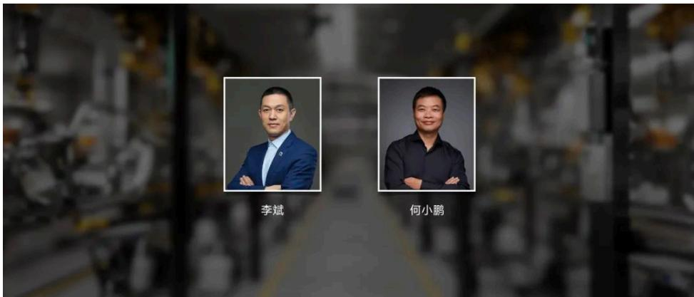

在调研过程中，李斌、何⼩鹏这俩哥们，⼀直⼒劝⼩⽶造⻋。说实话，我到今天也想不明⽩，这样做，对他们有啥好处，他们难道不怕汽⻋⾏业⼜多了⼀个“友商”吗？也许，他们俩就是单纯的为我好，为⼩⽶好。

随着调研的深⼊，我越发感受到，智能电动⻋的趋势已经不可阻挡。

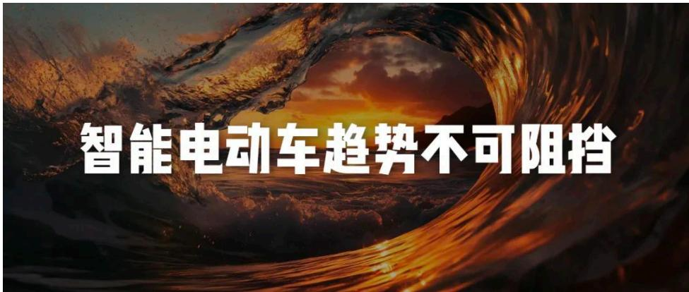

3⽉24⽇，我向董事会汇报了调研结论：智能电动⻋是⼤势所趋，汽⻋和消费电⼦⾏业正在快速融合，⼩⽶必须⼲！同时，也表达了我们的担⼼，汽⻋会像⼿机⼀样赢家通吃，只有⼲到全球前五才能活下去。如果决定⼲，⼀定要做⻓期投⼊的打算，⾄少要投100亿美元。

经过激烈的讨论，董事们回复说：⽀持，但由于投⼊太⼤，雷军要亲⾃带队⼲！

# 1.3艰难抉择

我完全没有想到董事会有这样的要求。之后的那⼏天，我每天都在天⼈交战中度过。

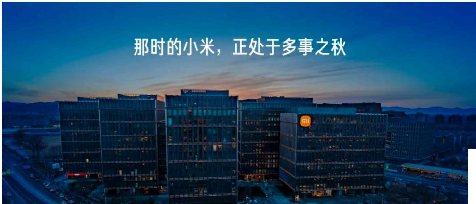

那时的⼩⽶，正处在多事之秋。上市两年半，我们正在经历从游击队向正规军转型，特别痛苦；同时，⼿机⾼端化刚刚起步；就在这个节⻣眼上，我们培养多年、寄予厚望的年轻⾼管周受资离职。

所有事情交杂在⼀起，在我⼼⾥，乱成⼀团麻。

每个深夜，当我⿎⾜勇⽓，准备⼤⼲⼀场；第⼆天早上醒来，太阳升起的时候，我⼜迷茫了。我反复问⾃⼰：

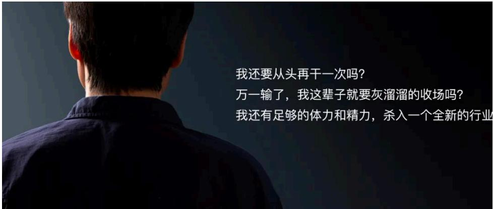

创业这么苦，我真的还要从头再⼲⼀次吗？创业⻛险这么⼤，万⼀输了，我这辈⼦就要灰溜溜的收场吗？甚⾄，我还有⾜够的体⼒和精⼒，杀⼊⼀个全新的⾏业吗？

我想了整整⼀周才下定决⼼。3⽉30⽇，我回复董事会：“如果这件事必须⼲，如果⼤家觉得我合适，为了⼩⽶，我愿意挺身⽽出！”

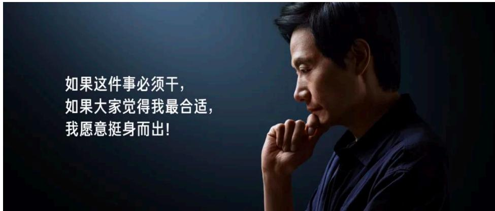

这不是⼀时冲动，也不是权宜之计，⽽是我70多天深思熟虑后的决定。

那⼀刻，我的⼼中只有7个字：虽千万⼈吾往矣！

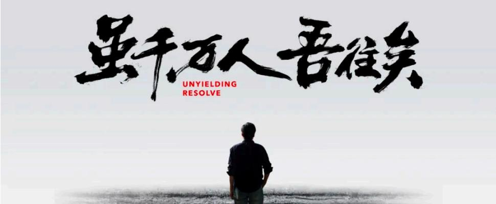

# 1.4为⼩⽶汽⻋⽽战

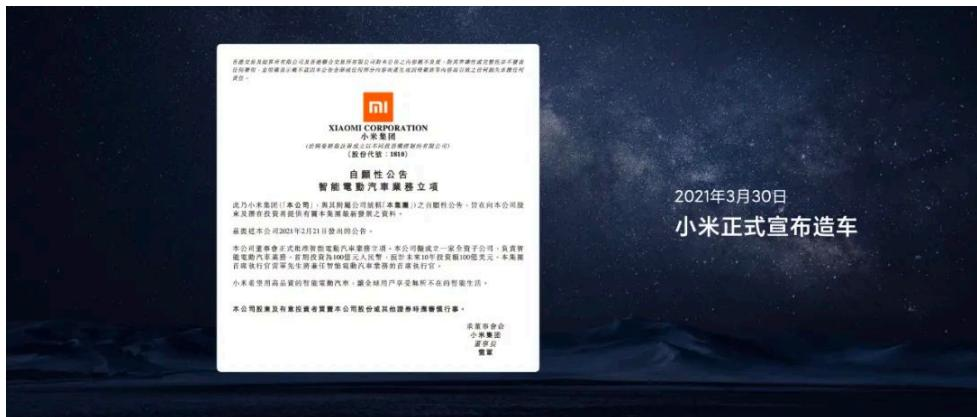

2021年3⽉30⽇，⼩⽶发布公告：正式决定造⻋，雷军牵头，未来10年全资投⼊100亿美元。

⼩⽶造⻋，100亿美元投⼊，这个消息震惊了全⾏业。

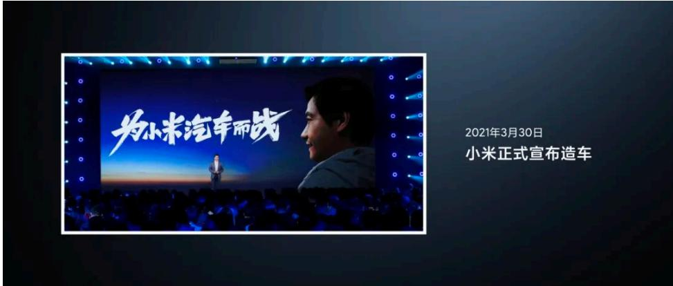

当晚我们举办了发布会。那天我状态其实特别不好，得了重感冒，嗓⼦⼏乎说不出话来。

我没有给⾃⼰留任何退路，在台上斩钉截铁地说，“⼩⽶汽⻋是我⼈⽣最后⼀个创业项⽬。我愿意押上⼀⽣全部的声誉和成就，为⼩⽶汽⻋⽽战！”

现场响起了雷鸣般的掌声。直播弹幕上，满屏都是“⼲翻特斯拉”。那⼀刻，我百感交集。

# 1.5 不眠之夜

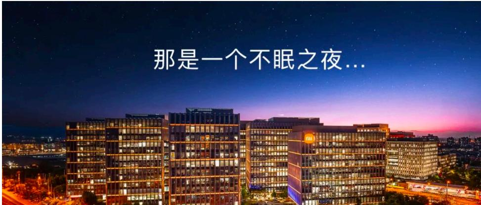

那⼀晚，是⼩⽶的不眠之夜，也是汽⻋⾏业的不眠之夜。

我收到了⽆数的消息，最触动我的是，凌晨5点，⼀位同事发来的。

他叫刘安昱，⼩⽶早期创业者，37号员⼯。他从⼩痴迷汽⻋，本来以为这辈⼦跟造⻋⽆缘了，业余时间就⾃⼰动⼿攒了⼀辆房⻋过过瘾。

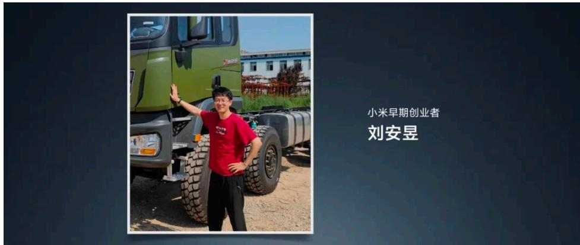

那天晚上，他在⼴州出差，看了直播后，激动不已，拉上⼏个同事去珠江边喝酒。喝完酒后，⼜在江边⾛了整整⼀夜。到了凌晨5点，他下定决⼼，这个机会⼀定不能错过，就给我发了信息：只要让他参与，⼲什么都⾏！

那⼀夜，彻夜难眠的还有很多⼈，⽐如李⽥原。

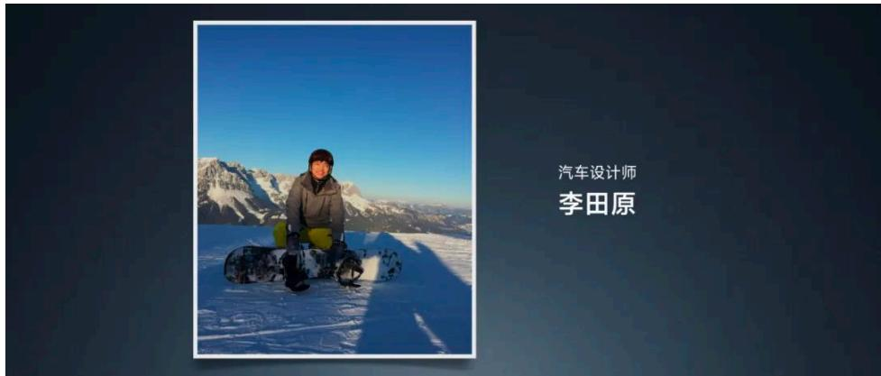

他在宝⻢德国总部，负责iX这辆⻋的设计，算是在欧洲混得很不错的中国设计师。看完那晚的发布会，他被⼩⽶的决⼼深深震撼，⽴刻萌⽣了加⼊⼩⽶的愿望。

其实，放弃宝⻢总部的⼯作，放弃欧洲舒适的⽣活，说服家⼈⼀起回国，这对任何⼀个⼈来说，都不是⼀个容易的决定。但他依然果断辞职，收拾⾏李，举家回国，投身到⼩⽶汽⻋的创业之中。

还有⼀个⼈，他叫胡峥楠。

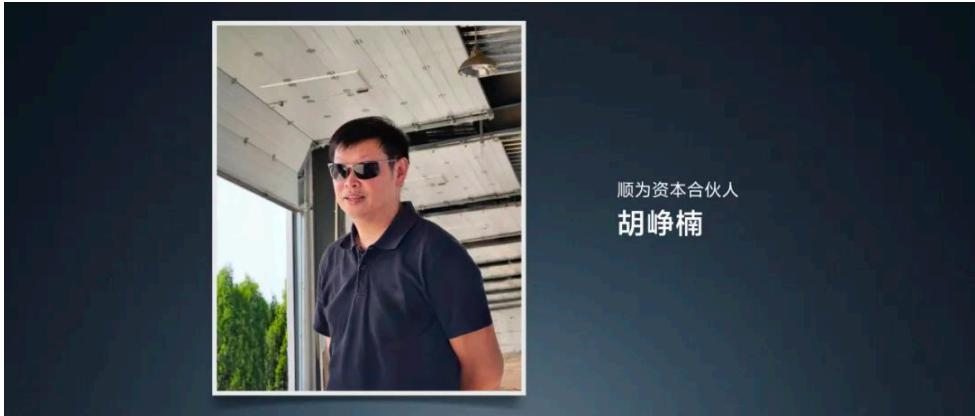

他曾两次拜访过⼩⽶。⼩⽶官宣造⻋后的⼀个晚上，⽼胡突然来电话，他造⻋20多年，国企、⺠企都呆过，⾃⼰也创过业，他跟前东家的合同到期了，想出来看看，特别想知道互联⽹公司到底是如何造⻋的。后来，他加⼊顺为资本，再后来，他兼任了我的顾问。

就这样，⼀群热爱汽⻋的⼈，不顾⼀切，从五湖四海，⾛到了⼀起。

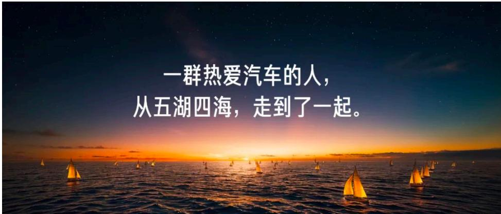

# 1.6为什么⾮要全资造⻋

⼩⽶造⻋在社会上也引起了巨⼤反响，我的⼀些企业家朋友也特别关⼼，4⽉5⽇下午，⼤家组团到访了⼩⽶。

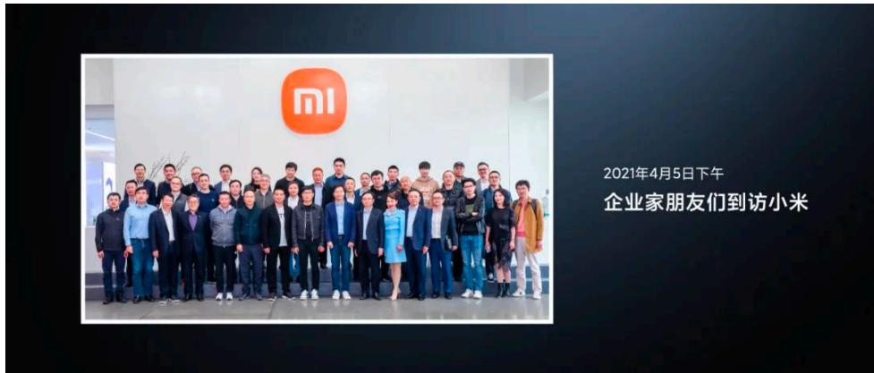

很多⼈问，现在下场，是不是太晚了？我说，智能电动汽⻋，智能才是灵魂，汽⻋的智能化才刚刚开始。  
其实，汽⻋是百年赛道，只要真⼼想⼲，任何时候开始，都是最好的时机。

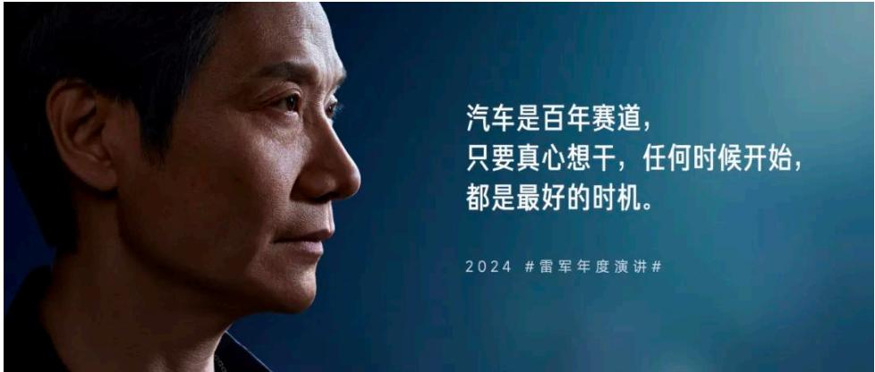

还有⼈问，⼩⽶汽⻋，为啥不拿出独⽴融资、独⽴上市呢？

当时造⻋很⽕，⼏家新能源公司股票暴涨，确实有⼏家投资机构给我们开价了，估值了百亿美元。⼩⽶汽⻋，还啥都没有，就估值100亿美元，⽽且，花别⼈的钱造⻋，⼏乎零⻛险。这样天⼤的好事，谁能拒绝呢？但我们深思熟虑后，还真的拒绝了。

因为造⻋周期很⻓，如果拿了别⼈的钱，想法就很难⻓期⼀致。⽽且，在⼩⽶内部造⻋，⼿机很多核⼼技术和研发资源都可以直接⽤。我也⾮常清楚，造⻋难度很⼤，光靠我⼀个⼈肯定不⾏，所有部⻔必须⻬⼼协⼒。

最后，我们下定决⼼，不融资⾃⼰⼲，钱全部⾃⼰掏，⻛险全部⾃⼰扛，只要能把⻋造好！

那天，王传福、李斌、何⼩鹏、李想都到了。王传福后来告诉我，他很佩服我们的勇⽓，当时多少还是为我们捏了把汗。

# 1.7勇⽓与抉择

这就是⼩⽶造⻋的起点。

如果不是遭遇“美国制裁”这样巨⼤的冲击，我们肯定不会贸然进军汽⻋这样复杂的⾏业，也不会有今天的⼩⽶SU7。

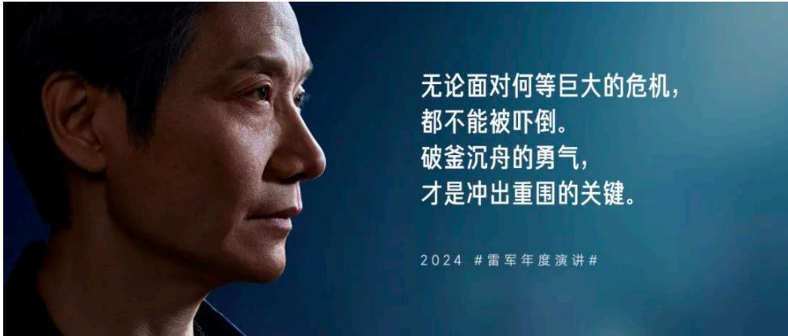

所以，⽆论⾯对何等巨⼤的危机，都不能被吓倒。破釜沉⾈的勇⽓，才是我们冲出重围的关键。

# ⼆、直⾯挑战

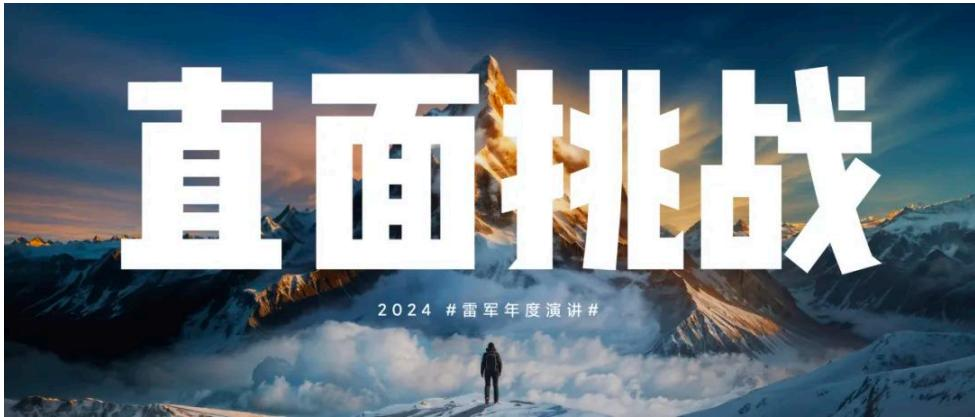

汽⻋⾏业每年都发布两三百款新⻋，竞争⾮常激烈。作为⼀个新来者，第⼀辆⾮常重要。我们该如何造⻋，造⼀辆什么样的⻋呢？

# 2.1造⼀辆什么样的⻋呢？

刚开始，我们团队找来了⼀⼤堆调研报告，开始学习和研究，写了上百⻚的分析材料。

我忍不住给⼤家泼了盆冷⽔，我说，不要搞那么复杂，先造⼀辆⼩⽶⼯程师们想买的⻋就可以！

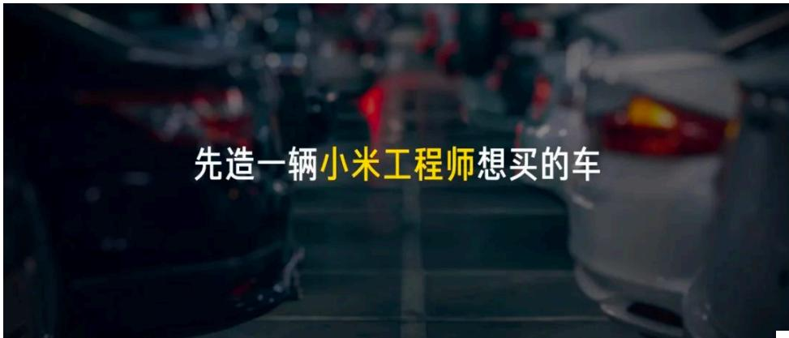

怎么才能精准把握他们的需求呢？⼤家的第⼀反应是，找个调研公司，花⼏个⽉时间，再整份报告。

我再次提醒⼤家，别浪费时间了，⼀百份报告也替代不了和⼀个真实⽤户⾯对⾯的沟通。

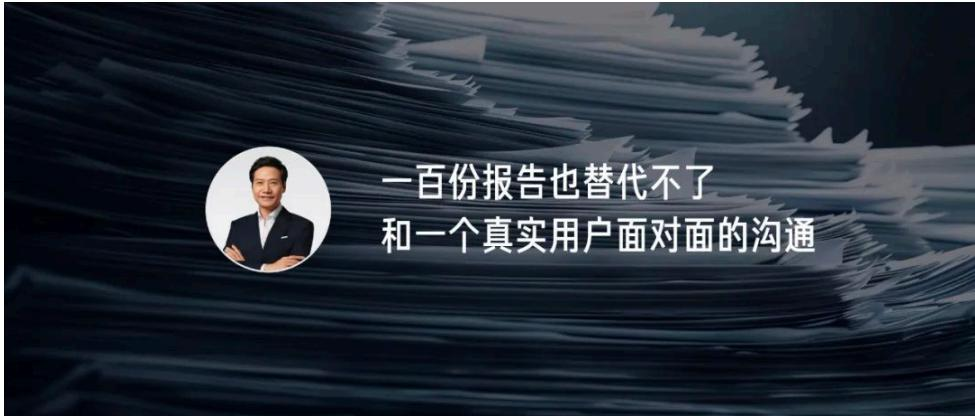

我们不辞⾟苦，约⼯程师⼀个⼀个⾯谈，⼀共谈了300多⼈。谈完后，我们觉得还不够，就到停⻋场⾥，⼀辆⼀辆数，看看⼤家到底开什么⻋。

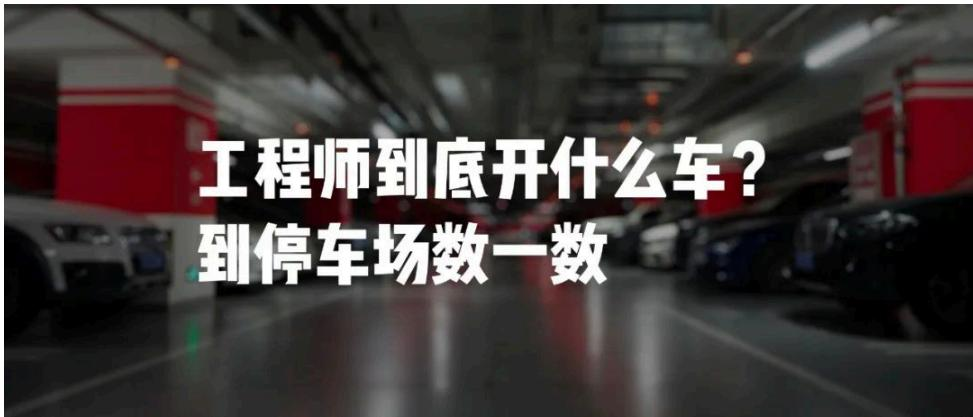

⽅法很⼟，但⾮常简单直接，很快就知道了⼤家买的⻋型、品牌和价格段。⽐如，轿⻋和SUV各占⼀半。

从研发⻆度来看，“⾼⻋容易低⻋难”，SUV容易⼲，轿⻋更难⼲，很多⻋企都是先做SUV。

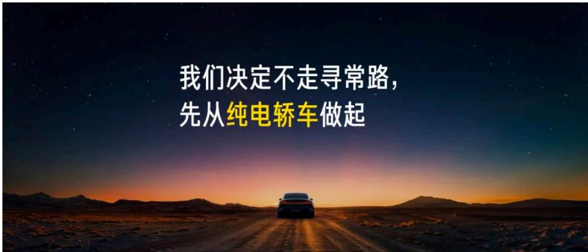

但我们决定不⾛寻常路，先从纯电轿⻋做起！等轿⻋做好后，再⼲其他⻋型就容易了。

# 2.2 从核⼼技术出发

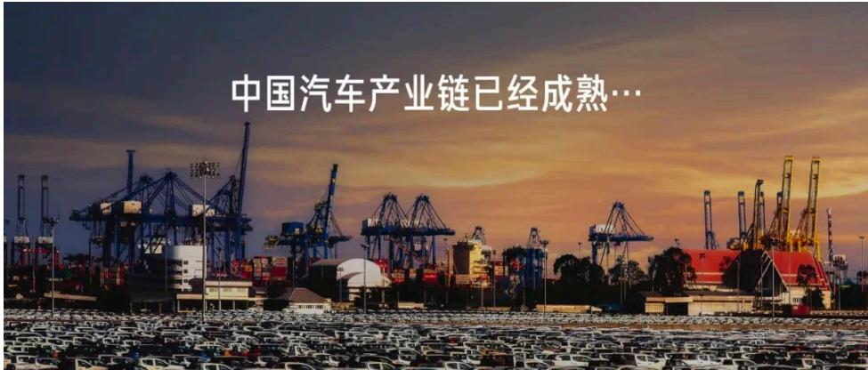

中国汽⻋产业链⾮常成熟，想攒⼀辆⻋，还是⽐较容易。

三年多前，很多⼈劝我：赶紧出⻋，找家代⼯就可以了，千万不要什么事情都⾃⼰⼲。

刚开始我们也想过，但很快铁了⼼，⼀定要从核⼼技术⼲起！这是因为，⼩⽶之前吃过⼤亏，14年前创业，就是从模式创新开始的，虽然刚开始成⻓速度很快，但根基不扎实，后来遇到了不少挫折。所以，这次创业，⼀开始就下定决⼼，不⾛捷径，不收购，不代⼯，从核⼼技术做起，⼗倍投⼊，认认真真造⼀辆好⻋。

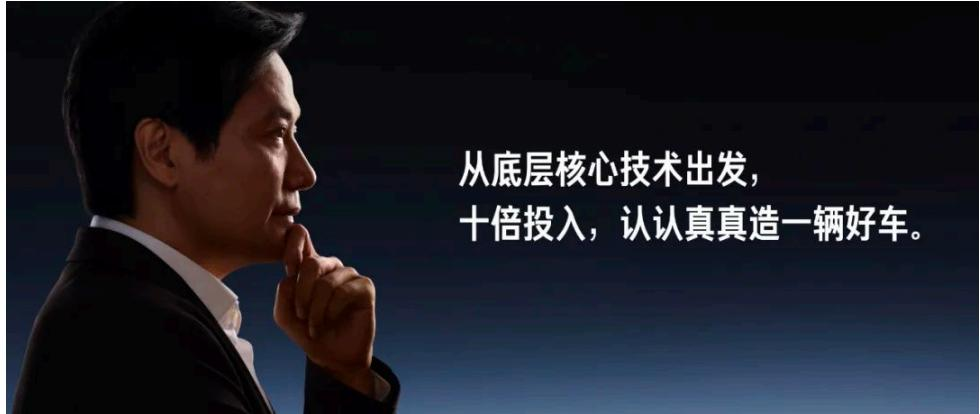

我们在核⼼技术上的投⼊⾮常坚决。⽐如，电机，我们同时⼲了三代；⼤压铸，我们⼀上来就⼲了两套；  
智能驾驶，我们全栈⾃研了纯视觉和激光雷达等两套⽅案。

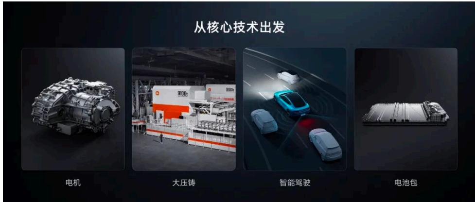

还有很多核⼼技术，都是这么⼲的。今天，我给⼤家讲讲电池包。

电池包⽐⼤家想象得要复杂，做⼀款电池包⼤约要⼗多个⽉、⼏千万的研发成本。⾏业⾥⼀辆⻋最多做两三款电池包。

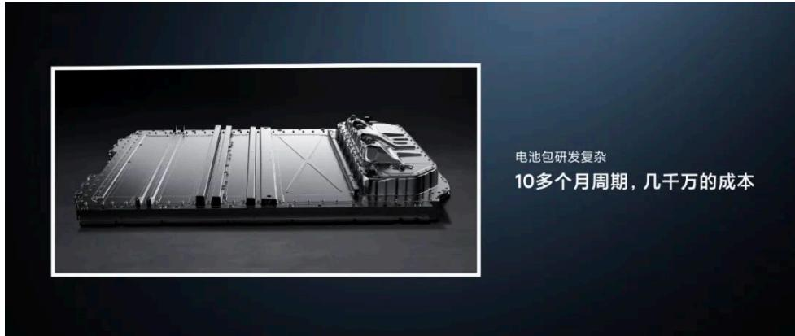

我们SU7 前后⼲了10多款，甚⾄还⾃建了⼀个电池包⼯⼚，把供应商折腾得够呛。我都不好意思了，专⻔给宁德时代的曾总打电话解释。

没想到，曾总说，他太理解了，他当年曾经给A公司做过电池，A公司⼀款⼿机，其实只需要⼀个电池⽅案，但在研发过程中做了200多个，最后只⽤了⼀个；他完全⽀持我们的策略，只有这样，才能真正把产品做好。

# 2.3 21天会议

就这样，2021年项⽬⼀开始，我们就同时启动了很多项核⼼技术的研发。

接着，披星戴⽉⼲了⼤半年，到了春节前，我们召开了第⼀次正式的项⽬评审会。没想到，分歧特别⼤，产品⽅案⼏乎要推翻重⼲。

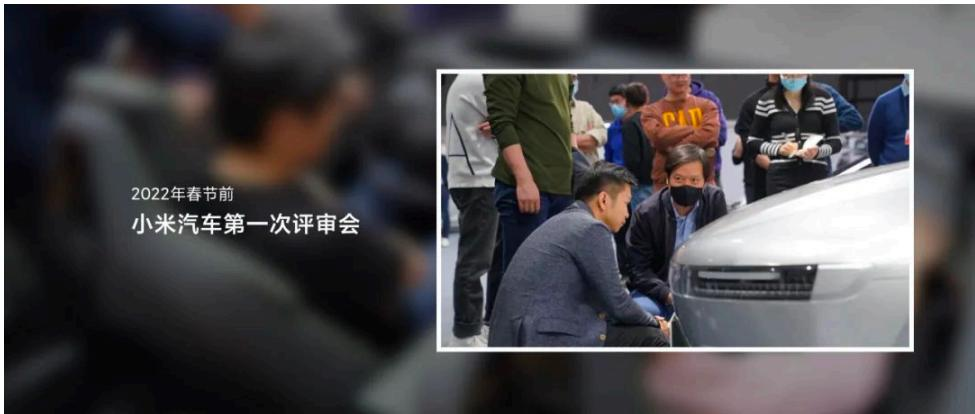

春节后，开⼯第⼀天，我取消了所有⽇程，把⼩⽶汽⻋团队最核⼼的⼗多⼈“抓过来”开会，商量如何解决。

谁也没想到，⼀个临时会议，最后整整开了21天。

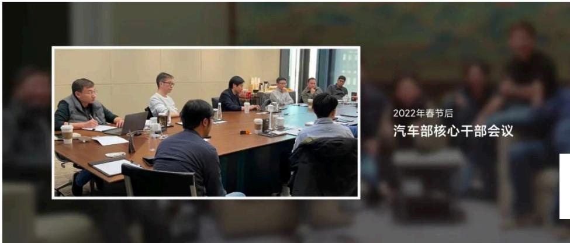

⼀开始⼤家还⽐较矜持，后来，争论就越来越激烈，有时能从早上9点吵到晚上9点。那个时候，我就下了决⼼，我们什么时候吵明⽩了，什么时候才散会。

⼤家来⾃五湖四海，有着不同的⽂化背景，第⼀次⻓时间、⾼密度⾯对⾯的讨论，让⼤家迅速相互了解，相互融合。

这21天的会议，我们达成了⼀个关键共识：⼩⽶作为⼀个新来者，能够顺利上牌桌，就是最⼤的成功

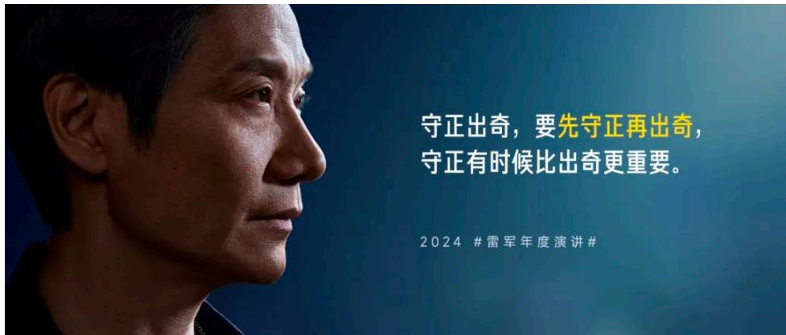

⼩⽶造⻋，要尊重⾏业规律，先守正，再出奇，不要盲⽬追求颠覆。

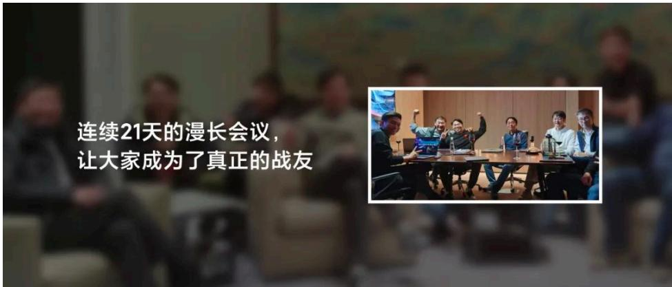

正是这21天的会议，我们每个⼈成了真正的战友。

# 2.4克服重重困难

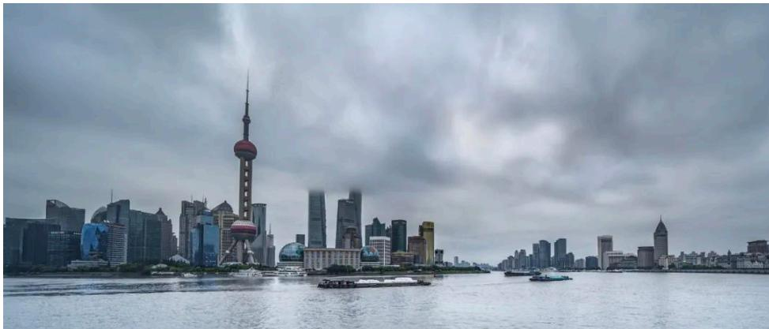

刚开完会，上海疫情爆发了，我们有很多⼯程师在上海，咋办？

⼤家⼿提肩扛，把能扛得⾛的实验设备全都扛回了家，就在家⾥做研发。

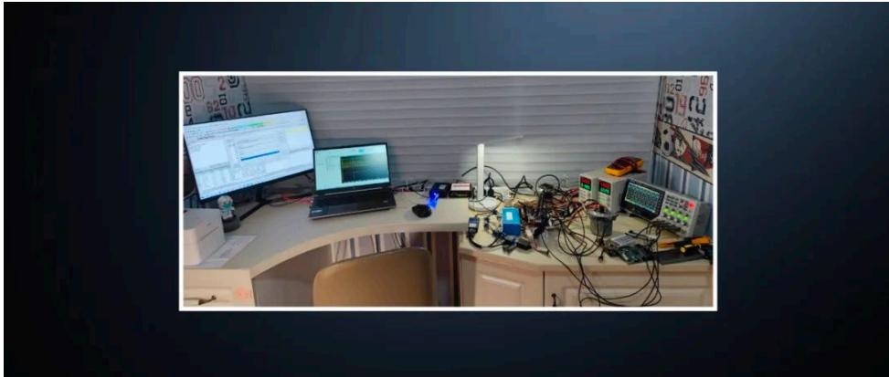

有⼀位同学，把设备搬回家，就在家⾥搭起了研发环境，⼩⽶超级电机的控制软件，就在他的客厅⾥，第⼀次真正运转起来了。

这是⼀段难忘的奇特经历，同事们相隔如此遥远，但⼜感觉如此紧密。⼩⽶SU7绝⼤部分的产品决策，都是在各种视频会议中完成的。

这段时间，我们还办了多次线上庆功会，我们把红酒寄到同事家⾥，⼤家⼀起云喝酒。

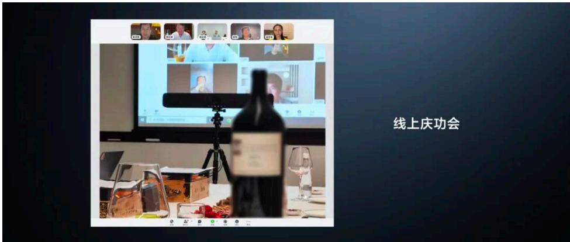

就是这样⼤⽆畏的⾰命浪漫主义精神，帮助我们克服重重困难，项⽬依然按计划稳步推进。

# 2.5 试产⻋

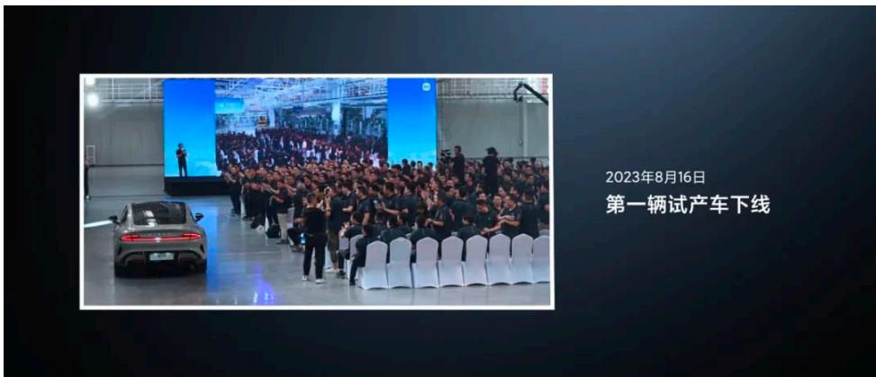

2023年8⽉16⽇，第⼀辆试产⻋从⼯⼚产线上缓缓驶出来，所有⼈都激动不已。

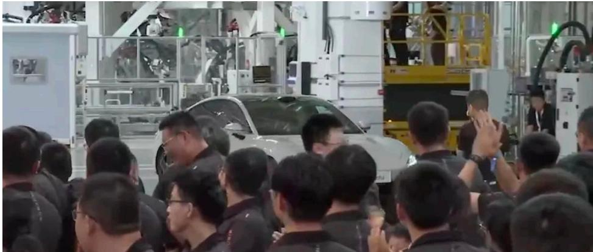

经历这么多的峰回路转，我们依然如期交付，这真的是⼀个奇迹！我们的团队⾮常了不起，⼏乎每个组都是超⽔平发挥！

下线仪式结束后，同事们逐渐散去。我⼀个⼈围着试产⻋，慢慢绕了好⼏圈，打开⻋⻔，⼀个⼈坐在⾥⾯，坐了很久很久。我⾃⼰都不敢相信，我们的⻋真的造出来了！

# 2.6 勇⽓与决⼼

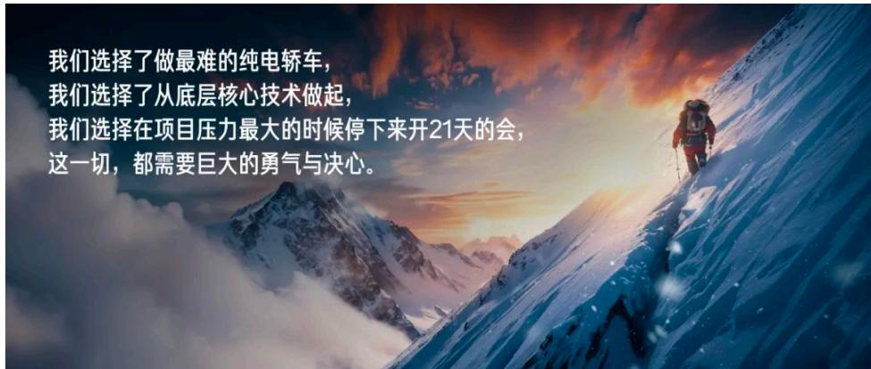

我们选择了做最难的纯电轿⻋，我们选择了从底层核⼼技术做起，我们选择在项⽬压⼒最⼤的时候，停下来开21天的会，这⼀切，都需要巨⼤的勇⽓与决⼼。

因为，我们深知，只有坚持做难⽽正确的事情，才能⾛得更远，⼩⽶汽⻋才能成功。

# 三、躬身⼊局

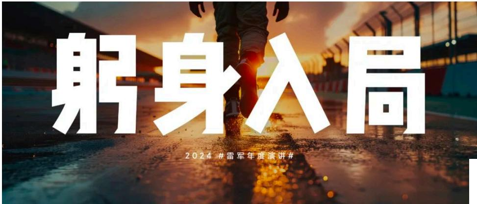

这⼏年，我琢磨最多的问题就是，我如何才能把⻋做好呢？

雷军年度演讲全文：小米造车，勇气从何而来，又如何冲出重围？ - 数英

后来，我发现，答案并不复杂：只有懂⼀⾏、爱⼀⾏，才能真正⼲好这⼀⾏。

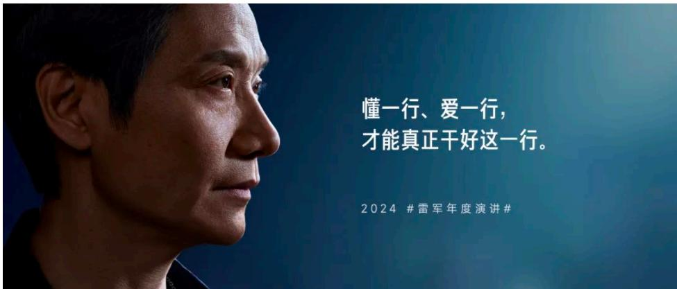

# 3.1 ⾃⼰开⻋

我造⻋的第⼀步，说起来，很简单，就是⾃⼰开⻋。

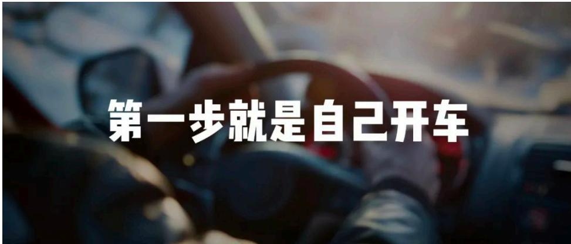

10多年前，由于⼯作繁忙，公司就给我配了专职司机，我就没怎么开⻋了。

从决定造⻋那⼀天起，我就下决⼼⾃⼰开。重新开⻋，有点像新⼿上路，⼿忙脚乱的，我花了⼏天时间才适应了。司机坐副驾上，同事们开玩笑说，⽼板亲⾃给你开⻋，你真的是太有⾯⼦了。

来⾃⻋企的同学们，开过各种各样的⻋，经验丰富，聊起⻋来都⻔清⼉。我刚跟他们⼀起⼯作的时候，很多东⻄我都不懂，压⼒巨⼤，于是，我下决⼼要试驾⾜够多的⻋。

⾸先借朋友的⻋，接着借身边同事们的⻋。⼤家买的⻋型基本类似，很快就借完了。接着，我就去各个品牌4S店去看⻋、去试驾。

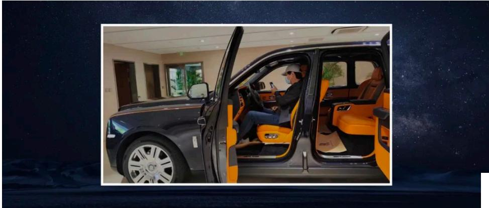

每次，我都戴着帽⼦和墨镜，全副武装的，但很快就被认出来了，是不是有点尴尬？

后来，我找到了⼀个好办法，就是在公司停⻋场转，看⻅没开过的⻋，就安排助理去借。

雷军年度演讲全文：小米造车，勇气从何而来，又如何冲出重围？ - 数英

助理就会在⻋上贴张借条。有的同事⾮常惊讶：真的是雷⽼板要借⻋吗？还专⻔找我来核实。

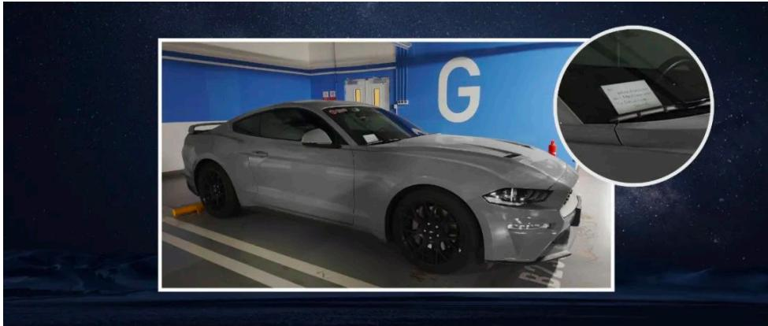

借⻋时，我喜欢和⻋主聊天，问⻋主⼏个问题：⼀、你觉得这辆⻋好在哪⾥、不好在哪⾥；⼆、你当初为啥买这辆⻋；三、下次你想换⼀辆怎么样的⻋。接着，认真开上⼀两天，再到⽹上看看资料和评论，对这辆⻋就有了完整认识。然后，洗完⻋，再加满油后，还回去。

每次换⻋，都有⼀个适应的过程。我遇到过好⼏次，⻋主在边上站着，我上⻋后⿎捣了⼏分钟，就是没有把⻋发动起来，急得⼀头汗。

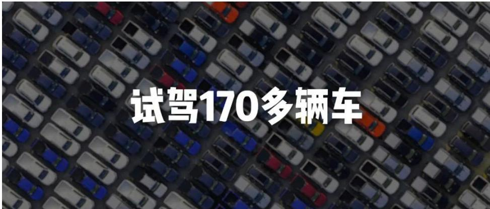

不知不觉，三年来，我⼤约试驾过170多辆⻋。

前些天，我整理了⼀下试驾笔记和资料，居然已经有20多万字了。

# 3.2 学赛⻋

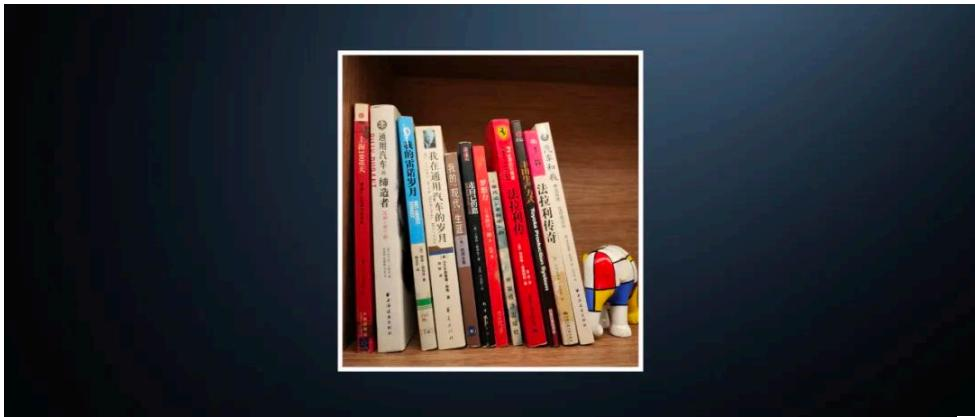

我还看了不少汽⻋巨头的传记，甚⾄还把过去看过的赛⻋电影都找出来，⼜重新看了看。

雷军年度演讲全文：小米造车，勇气从何而来，又如何冲出重围？ -数英

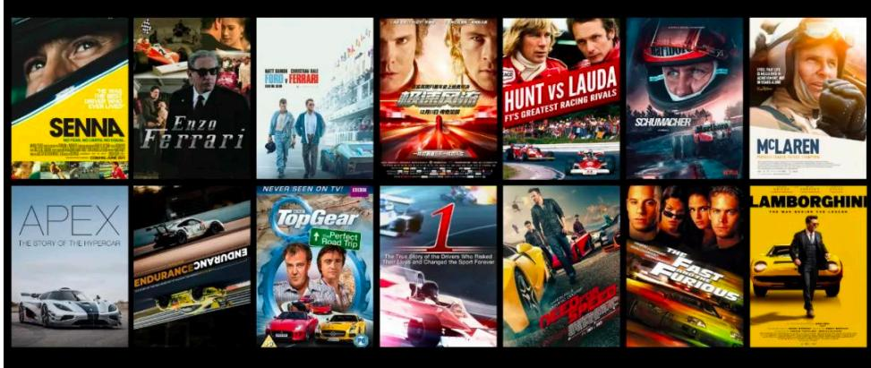

法拉利、保时捷、丰⽥等这些⻋企，他们⽼板都是很出⾊的赛⻋⼿，国内⻋企⽼板，听说开⻋也都不错。

我⼼⾥暗暗有了⼀个⽬标：我能不能把⻋开好，成为国内⻋企⽼板中开⻋最好的之⼀？甚⾄，我能不能也去开开赛⻋？

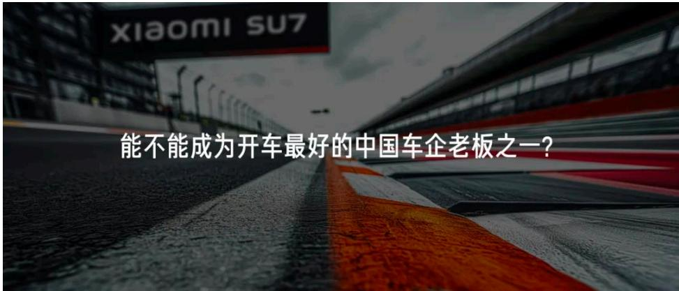

开赛⻋，多少有点危险。⽽且，像我这样的年龄去开赛⻋，是不是有点不靠谱呢？

我想了很久，还是下决⼼去试试。开赛⻋，需要先考个赛照。

我是在夏天学的赛照。赛⻋为了减重把空调都拆了，⻋⾥温度经常⾼达五六⼗度。

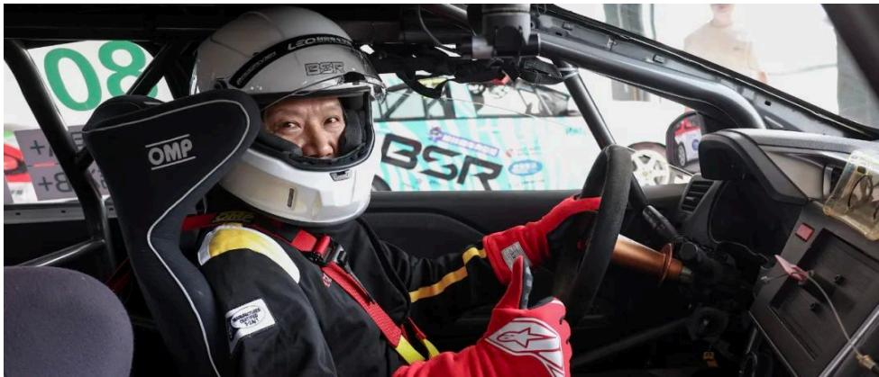

穿上防⽕材料做的赛⻋服，戴上头盔，坐在⾮常硬的运动座椅上，勒紧六向安全带，看起来很帅，但实际上⾮常不舒服。⼏⼗圈跑下来，全身都会湿透，感觉整个⼈都虚脱了。

作为⼀个新⼿，冲出赛道很常⻅的，⽽且⼀不⼩⼼，就很容易撞上防护墙，他们管这个叫“上墙”。平时撞⻋是个⼤事，学赛⻋后发现，赛道上撞⻋就是家常便饭了。

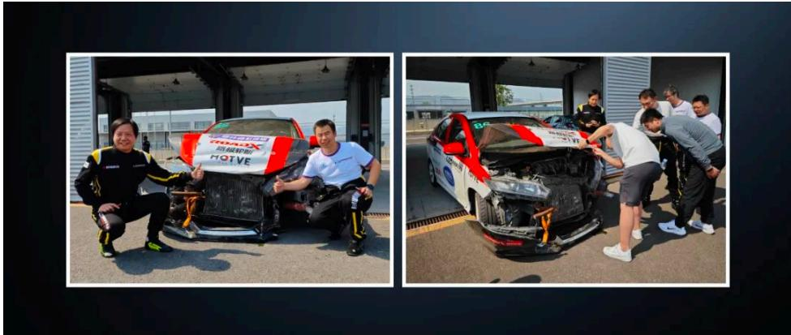

赛⻋是没有保险的，⼀撞就是⼀⼤笔钱。赛道上的规矩，撞⻋后各修各的⻋，被⼈撞了只能⾃认倒霉。

在这⾥，多说⼀句，赛⻋看起来很危险，实际上，⻋辆都经过改装，只要严格遵守规则，安全系数还是很⾼的。

为了提⾼⽔平，我还专⻔买了七轴模拟器，开模拟器也很累，⼀个⼩时开下来也是⼀身汗。

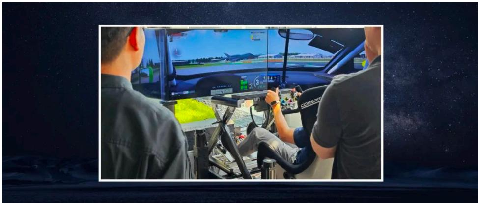

最后，吃了不少苦，我如愿以偿拿到了赛照！

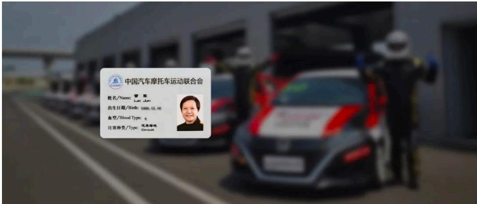

我不仅⾃⼰学，还拉着管理团队⼀起学。到⽬前为⽌，管理团队，加上⼯程师，已经有100多位同学拿到了赛⻋驾照。

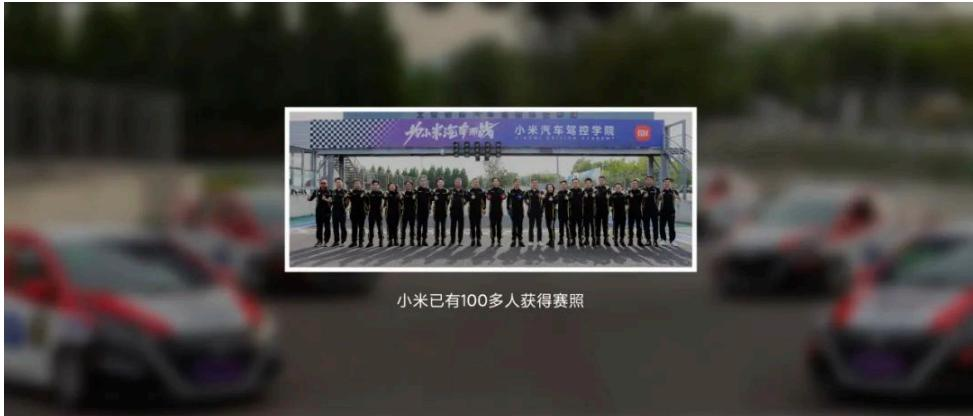

我相信，⼀⽀真⼼热爱汽⻋的团队，⼀定有能⼒把⻋做好。

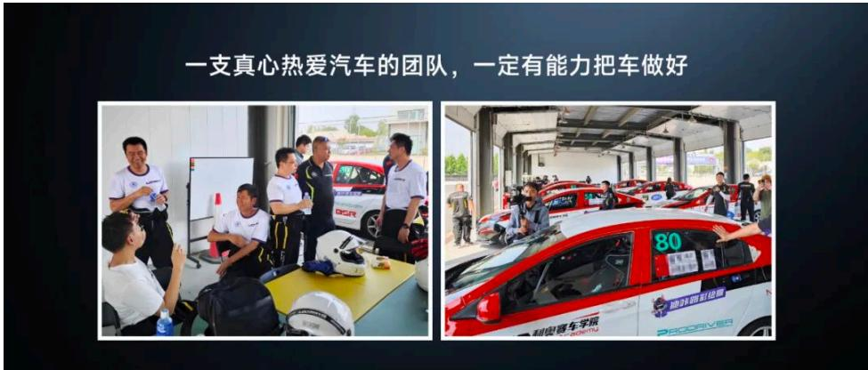

我们⼩⽶还举办了多次内部⽐赛，同学们参与⾮常踊跃。有⼀次内部⽐赛，我被⼀个同事在同⼀个弯道连续撞了两次，特别郁闷，最后还得⾃⼰修⻋。玩赛⻋这个过程，让我对⻋有了更深的理解。

# 3.3冬测与夏测

汽⻋研发的关键节点，我也坚持亲⾃参与，⽐如冬测和夏测。

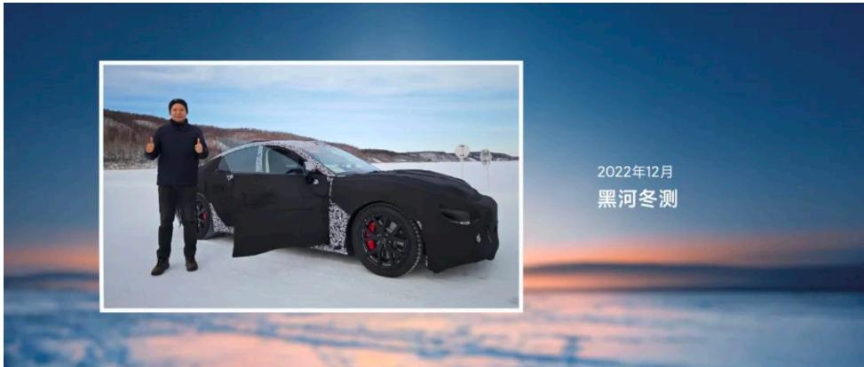

2022年底，我们的⼯程⻋如期进⼊冬测的环节。冬天的⿊河，⽓温低⾄零下三四⼗度，⾮常冷。

这是⼩⽶汽⻋的第⼀次⼤考。冬测的负责⼈⻅到我后，⾮常惊讶，他说，他⼲了20多年，还是第⼀次⻅到⻋企董事⻓亲⾃来冬测的。晚上吃饭的时候，他还专⻔叮嘱⻝堂加了⼀个菜。

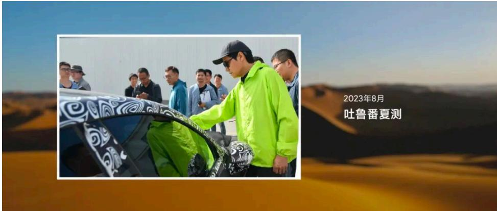

夏天的吐鲁番，⽓温⾼达50度。⻋在阳光下暴晒了⼀中午，烫得根本没法坐。说到这⾥，防晒真的太重要了。

夏测虽然艰苦，但还是给我们留下了很多美好的回忆。我印象最深的是吐鲁番⻄⽠，⼜⼤⼜甜，确实好吃，⽽且特别便宜，0.5元/公⽄，简直不可思议。

# 3.4 ⾼管亲⾃测试

SU7发布前，我们做了⾏业最⼤规模的实⻋路⾯测试。总测试⾥程达到了 540万公⾥。

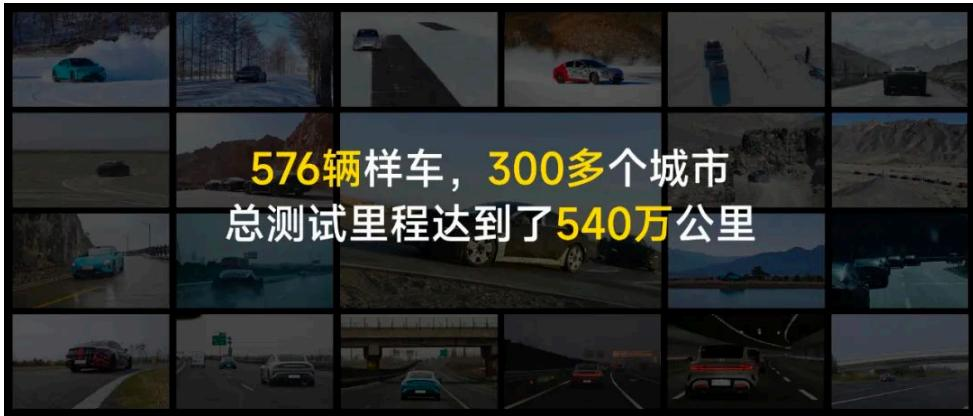

年初，在全国很多城市的⼤街⼩巷，⽹友们都看到了我们的测试⻋队。有⼈说，“⼩⽶汽⻋⾏不⾏？就看你们⾼管敢不敢开。”

⼀位⼯程师看到后，默默转发到群⾥，并专⻔艾特我。他的意思，我懂！我⼜转发到⾼管群，并且专⻔艾特了所有⼈。

⼩⽶⾼管们⽴刻响应，全部参与了测试，累计⾏驶⾥程超过10万公⾥。我⾃⼰参与10多次，累计5000多⾥。

其中最⻓的⼀次，今年1⽉份，从北京到上海，1276公⾥，从早上6点到晚上9点，我⼀个⼈开，前后15个⼩时！

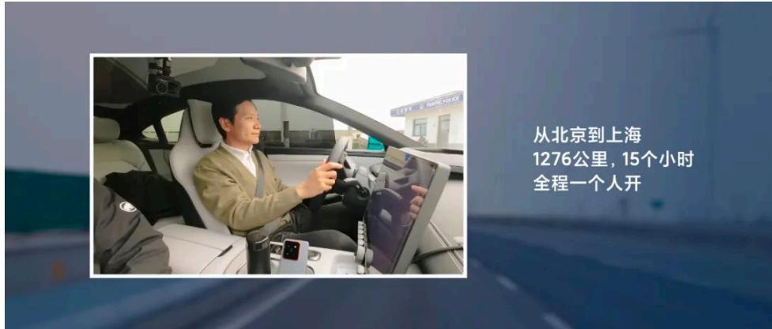

这次测试，公关同事们⾮常紧张，他们担⼼，因为我开，哪怕是最普通的剐蹭事故，都可能变成⼀场巨⼤的舆论危机。但我还是坚持⾃⼰亲⾃开。结果呢？

这次测试⾮常顺利，即使在冬天的⾼速场景，SU7 续航表现也尤为出⾊。

# 3.5勇⽓与⾏动

重新⾃⼰开⻋，学赛照、玩赛⻋，冬测、夏测、京沪⻓途测试，这些事情看起来都是⼩事，都很简单。但我的体会就是，勇⽓不是喊⼝号，⽽是每⼀步脚踏实地的⾏动。

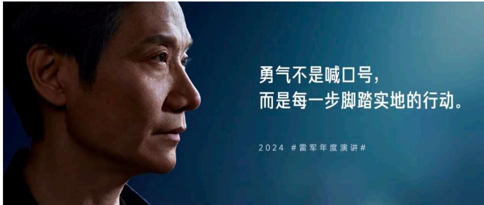

说到这⾥，⽹友们不停地催我，啥时表演漂移。我是初学者，⽔平⼀般，前段时间，⿎起勇⽓拍了⼀段，⼤家凑合看看就好。

# 四、横空出世

# 橫空出世

2024#雷军年度演讲#

造⻋这3年，我们内部紧锣密⿎，但对外，⼀直没有做过任何宣传。直到去年12⽉底，⼩⽶汽⻋才第⼀次正式亮相，有点像“横空出世”，关注度特别⾼。

# 4.1批评与质疑

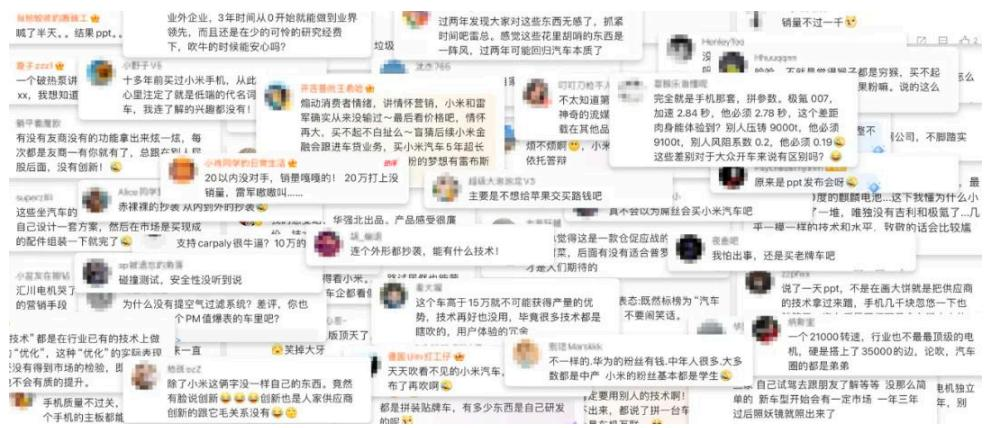  
紧接着，扑⾯⽽来的，就是各种各样的质疑、批评和诋毁。

“苹果⼗年都⼲不成，凭啥⼩⽶三年就能成？”“真的是你们⾃研的吗？”

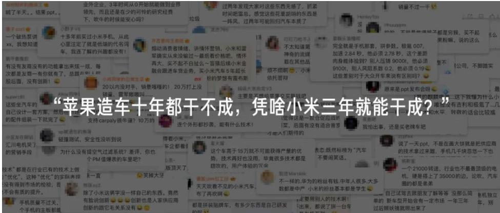  
雷军年度演讲全文：小米造车，勇气从何而来，又如何冲出重围？ - 数英

⿊稿如潮⽔般袭来，再加上友商推波助澜，当时漫⼭遍野的调侃和嘲讽，⽐如这句话，你们也许听到过，“军⼉，收⼿吧，外⾯都是XX”。

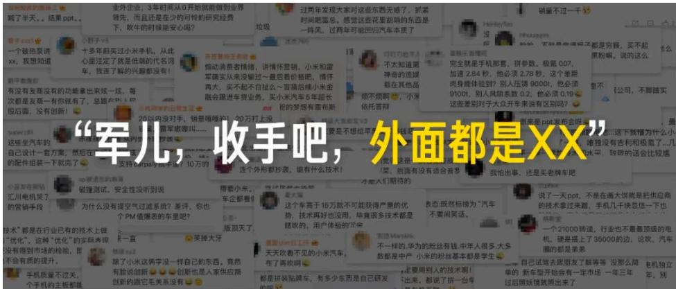

更严重的是，我们倾尽全⼒做的SU7，⼏乎所有⼈都觉得卖不动。

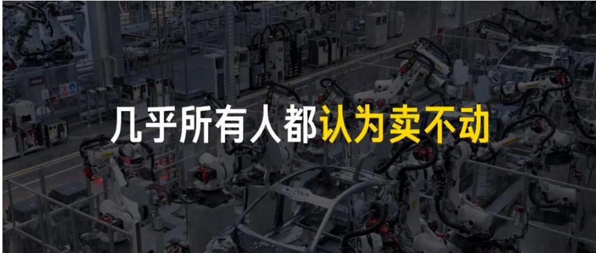

我觉得，SU7 体验和配置远超 Model3。⼤家告诉我，买Model3的，都是特斯拉的铁粉，不会买 SU7的。

我觉得，34C （宝⻢3/奥迪A4/奔驰C）⽤户要不要换辆更智能的电动⻋？结果，⼏个部⻔各出了⼀份报告，洋洋洒洒⼏⼗⻚，核⼼就⼀句话：34C⽤户只看品牌，肯定不买 SU7。

还有，我们挖空⼼思为⼥⻋主做了⼤量设计。但很多⼈认为，⼥⻋主根本不会考虑 SU7 这样的性能⻋。

怎么办？我找媒体朋友们帮忙出主意，前后聊了23位。没想到，⼤部分⼈⾮常不看好，认为纯电轿⻋⽉销3000台就要烧⾼⾹了。

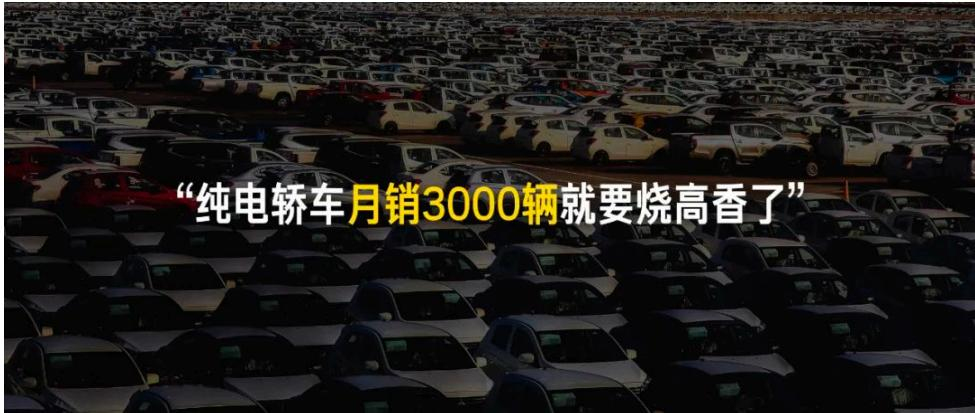

⼤家建议我调低预期，不要讲性能，不要讲驾驶，讲讲科技和⽣态就可以。我尝试说服他们，有⼀次，说了两三个⼩时，说到⼝⼲⾆燥，完全⽆法改变他们的观点。

这让⼈⽆⽐绝望，我们整个团队都笼罩在焦虑之中。那段时间，不少⼈说我特别憔悴。

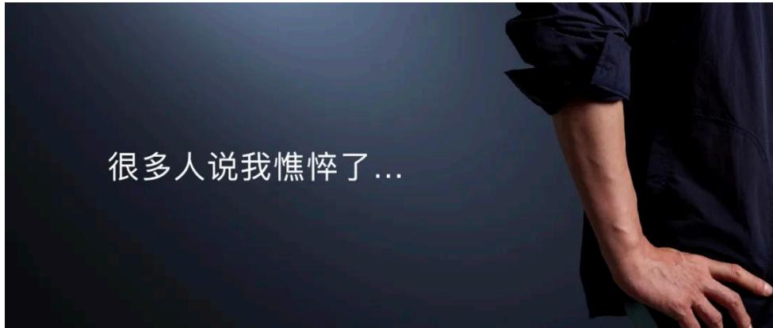

# 4.2疯狂的产能⽬标

在我最郁闷的时候，我想起了2年前，我试驾过同事的⼀辆福特野⻢，40多万的性能⻋。

那位同事告诉我，这辆⻋就是他的 Dream Car。

他⼯作⼗年后买给⾃⼰的奖励。每天早晨，他⼀坐进⻋⾥，就充满了打拼的⼒量；每天晚上到家后，都还会在⻋⾥坐⼀会。

他的话让我坚信，⼈⽣值得被奖励，我们的SU7，就是为这样的奋⽃者设计的 。

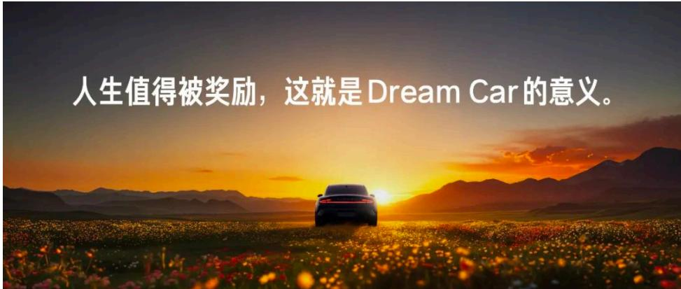

我相信，⼈们对 Dream Car的向往；我相信，过去3年间我们全⼒以赴的投⼊；我相信， SU7 超凡的体验和魅⼒。所以，⽆论有多少⼈不看好，我始终坚信，SU7 ⼀定会⼤卖。

今年2⽉，敲定全年产量时间到了。我们该定多少货呢？

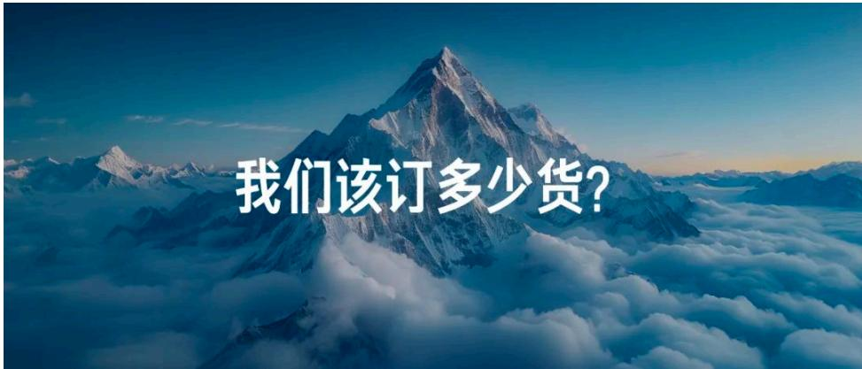

很多⼈建议定3万辆⾜够了，订货稳点好。我内⼼特别⽭盾，⼀⽅⾯担⼼卖不动，另外⼀⽅⾯担⼼，定少了不够卖。最后，我们下定决⼼，定了 7.6万辆！

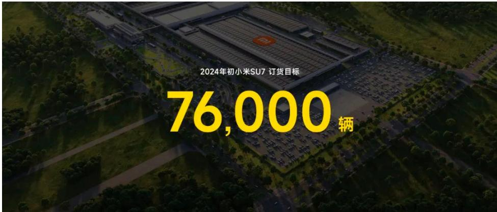

这将是能跟Tesla Model 3⽐肩的销量。这也意味着，扣除产能爬坡时间，⽉销必须达到1万辆；如果卖不出去，巨⼤的库存，将是灭顶之灾。

我深知，7.6万辆，绝对是⼀个疯狂的⽬标，但我们没有退路，必须往前冲！

# 4.3 媒体试驾

就在巨⼤的焦虑中，SU7正式发布的⽇⼦逐渐临近。

3⽉中旬，我们专⻔安排了⼀次媒体试驾会，媒体⽼师们第⼀次真正接触了 SU7，有些⼈观点开始改变。

他们说：“⽆法想象这是⼩⽶造的第⼀辆⻋，完成度如此之⾼，驾驶质感也很⾼级，⼩⽶确实有⾼⼈。”

我悬着的⼼，才稍稍踏实了⼀些。

# 4.4 定价难题

更⼤考验是定价。价格如果定错了，后果更是不堪设想，可能导致上百亿的损失，3年时间付之东流。

很多⼈也许并不了解，纯电⻋成本⾮常⾼，除了特斯拉，所有纯电⻋都在巨额亏损。只有合理定价，我们的业务才能健康成⻓，我们才能持续为⽤户提供优质的产品；如果简单定个超低价，本质上是饮鸩⽌渴。

⽹上谣传 SU7 定价 14.9万，甚⾄ 9.9万，对SU7的产品定位造成了严重误导，我⽴刻站出来否认。更⼤的压⼒其实来⾃内部，我们销售同学⼀直信⼼不⾜。

发布会前⼀天的晚上，最后⼀次定价决策会。时间不⻓，但争论⾮常激烈。

我认为，SU7 配置和体验远超 Model3，我们要有勇⽓把价钱定到 21.59万，这个价钱⽐Model3已经便宜3万，⾮常有竞争⼒。

就是这样，销售同学们还是⾮常担忧。

最后，办公室⾥陷⼊了⼀⽚寂静，直到⼀位⾼管说，“就这个价吧。⽆论卖多少辆，我们认了！”

# 4.5 SU7 正式发布

3⽉28⽇，⼩⽶SU7 正式发布。

发布会刚开始的时候，我嗓⼦都是沙哑的，异常紧张，就像⼗年寒窗苦读的学⽣，终于参加⾼考了。讲了半⼩时后，才逐渐放松下来。

最后，讲到 SU7 为谁造的，过去三年压在⼼⾥的很多话，⼀下⼦脱⼝⽽出。我说，⼩⽶SU7，就是为这样的⼈设计的：

他们不⽢于平庸，还在为梦想奋⽃；他们向往先进的科技，渴望幸福的⽣活；他们⼼中有⽕、眼⾥有光，浑身都闪耀着乐观与⾃信的光芒！

当我们公布定价，现场持续不断的阵阵欢呼，我的⼼⾥终于踏实了：⼩⽶SU7 成了！

发布会结束后，我正在接受媒体采访，有同事跑进来，⾮常激动告诉我，4分钟⼤定破1万，27分钟破了5万！

那⼀刹那，让我感觉，⼀切都如此美好，过去三年所有委屈和不被理解都不重要了

有很多⽤户，没有试驾过，甚⾄没有看过真⻋，在发布当晚，就直接预定了。有位朋友讲述了⼀位⽶粉的故事，让我特别感动。

他叫申⼒⽴，39岁，四川⼤学数学学院教授。他是⽶粉，多年来⼀直默默地⽀持着⼩⽶。3年前⼩⽶官宣造⻋，他觉得，这是⼩⽶的关键时刻，他必须要站出来⽀持。

他在⼩区⾥买了⼀个⻋位，专⻔留给⼩⽶汽⻋，⼩⽶汽⻋发布当晚，第⼀时间下单。如今，空置三年的⻋位，终于等来了创始版的⼩⽶SU7。

这是何等的信任呀！在⾸⻋交付仪式上，我给⻋主开⻋⻔，这是对⽶粉朋友们，发⾃肺腑的感激。

这个⽆意之举，在⽹上⽕了，甚⾄演绎成“千亿CEO给我开⻋⻔”的段⼦。

# 4.6 北京⻋展

到了今年北京⻋展，我成了别⼈眼⾥的“营销之神”、“⾏⾛的流量”。但我认为，这全部来⾃⼩⽶SU7 ⼀眼万年的魅⼒和巨⼤的成功。

5⽉，我们正式宣布，在所有伙伴全⼒⽀持下，⼩⽶SU7全年销量⽬标（其实只有9个⽉），保底10万辆，冲击12万辆。这绝对是⼀个刷新⾏业纪录的奇迹。

就这样，⼩⽶汽⻋成功挤上了牌桌，但我深知，我们离真正的成功还很远，我们的⻓征才刚刚开始！

# 五 勇⽓与信念

过去的3年，对于我，对于⼩⽶，都是⼀段脱胎换⻣的经历。

⼩⽶SU7 成功的背后，凝聚着巨⼤的勇⽓。这不是某⼀个⼈的勇⽓，⽽是⼩⽶集团40000多⼈共同的勇⽓。·

勇⽓，并⾮没有恐惧，⽽是⾯对恐惧，依然坚定不移。

勇⽓，来⾃坚定的信念，奔涌不息的热情，还有，每⼀步的脚踏实地。勇⽓，就是⼈类最伟⼤的赞歌！朋 友们，愿你永远拥有勇往直前的决⼼，和披荆斩棘的勇⽓！

# 满配之下极致轻薄

⼩⽶MIX Fold 4 ，厚度 $9 . 4 7 \mathsf { m m }$ ，重量 226g，达到了直板机⽔平。⾃研的⼩⽶⻰⻣转轴 2.0 体积缩减$34 \%$ ，超强钢占⽐达 $8 2 . 6 \%$ ，同时「全碳架构」实现⼤幅减重且强度升级。整机堆叠也有重⼤突破，⾸次采⽤三层五⾯主板设计，展现精密⼯艺之美。此外，有线 $^ +$ ⽆线双⼩⽶澎湃秒充，加上第三代骁⻰ 8 移动平台与 $5 1 0 0 \mathsf { m A h }$ 全新⽴体异形电池，带来强劲续航。

⼩⽶MIX Fold 4 在影像⽅⾯也可圈可点，搭载徕卡光学 Summilux 镜头与 2X 徕卡浮动⻓焦，四摄五焦段能⼒提升。继承的 Xiaomi AISP 与⼤师⼈像，以技术引领审美。⼩⽶⻰⻣转轴能带来 $4 5 ^ { \circ }$ -135° 超⼤⻆度⾃由悬停，⽆论是⾃拍合影，还是延时摄影，均得⼼应⼿。

⼩⽶MIX Fold 4，满配之下极致轻薄，8999 元起，将于 7 ⽉23⽇开售。

# 七、⼩⽶MIX Flip

# ⼩折叠的分⽔岭之作

⼩⽶MIX Flip，有效解决了⼩折叠⼿机核⼼体验痛点。它配备4.01英⼨⼤外屏，适配 200多个⽇常应⽤，外屏「智能悬窗」能实时显示焦点通知，可快捷切换最近任务；同时，搭载外屏窄缝听筒和独⽴⻨克⻛，外屏接打电话⽆需外放。此外，第三代骁⻰ 8 移动平台搭配超豪华⽴体散热系统，4780mAh ⼩⽶⾦沙江电池，让⼩折叠拥有媲美直板机的性能和续航体验。

⼩⽶MIX Flip 搭载了徕卡光学 Summilux 镜头和 2X 徕卡浮动⻓焦，配合 Xiaomi AISP 与⼤师⼈像，实现了技术与审美的双重突破。 $4 5 ^ { \circ } - 1 2 0 ^ { \circ }$ 的多⻆度悬停，再加上全尺⼨⼤外屏，可解锁更多拍摄⽅式，⽆论是多⼈合拍、旅⾏帮拍，还是⽇常 Vlog 等场景，都能⾃如应对。

⼩⽶MIX Flip，⼩折叠的分⽔岭之作，5999元起，将于 7 ⽉ 23 ⽇开售。

# ⼋ Redmi K70 ⾄尊版性能魔王，全⾯进化

Redmi K70⾄尊版实⼒强劲，搭载了旗舰双芯，天玑 $9 3 0 0 +$ 、定制狂暴游戏独显 D1芯⽚，以「狂暴引擎3.0」贯通双芯调校；同时，散热系统全新升级，新⼀代 3D 冰封散热™️ ，搭载创新 3D 凹凸台冰封循环冷泵，能稳定释放⾮凡性能。

Redmi K70⾄尊版，体验也有新突破。Redmi ⾸次搭载⼩⽶⻰晶玻璃，轻盈且坚固。⾼强度⾦属边框搭配四曲⾯玻璃后盖，实现美感、⼿感与耐⽤性的完美统⼀。屏幕升级为新⼀代 1.5K 旗舰直屏，带来更科学的护眼策略。此外，还配备了⾏业罕⻅的三项旗舰体验：IP68 2 ⽶防⽔、120W 神仙秒充以及 5500mAh 超⼤电池。Xiaomi AISP ⾸次落地 Redmi，将开启影像新篇章。

另外 Redmi 与兰博基尼汽⻋ SQUADRA CORSE ⼆度携⼿，推出全新跨界杰作 ：K70⾄尊冠军版。全新竞速设计，性能释放更极致，致敬赛道信仰。

Redmi K70 ⾄尊版，2599 元起，7⽉19⽇发布会后同步开售。Redmi K70 ⾄尊冠军版，3999 元， 7⽉1⽇发布会后同步开售。

# 九、Xiaomi Buds 5⽆损⾳质，

# 天籁原声

Xiaomi Buds 5 表现出⾊，佩戴舒适⽆感，颠覆⾳质提升。它采⽤全新轻量化设计，单只⽿机轻⾄4.2g，舒适不压⽿。遵循⼈体仿⽣曲率，让⽿机流线进⼀步贴合⼈⽿曲⾯，⾃然悦⽿。

Xiaomi Buds 5 拥有旗舰⾳质体验，搭载内外超感双磁单元，配合⾼通 aptX Lossless 全链路⽆损⾳频及哈曼 AudioEFX 联合调⾳，实现听感的多维提升。

此外，它具备舒适主动降噪、3Mic AI 通话降噪、独⽴空间⾳频等实⽤听⾳功能。同时，⽿机还能独⽴录⾳，将语⾳转⽂字，精准区分⼈声，⼀键⽣成信息摘要，轻松成为智能助⼿。

Xiaomi Buds 5 ，售价699元，现已正式开售。

# ⼗ ⼩⽶⼿环9

# 质感出⾊，时尚随⼼

⼩⽶⼿环9质感⼤幅升级，多彩⾦属机身让整体坚固⽽轻盈；陶瓷特别版温润如⽟，⻓久佩戴仍舒适⾃在；  
同时搭配多款精致快拆腕带，可随⼼搭配。

⼩⽶⼿环 9 不仅有颜值，实⼒依然出众。⾼精度监测模组使⼼率、睡眠监测准确率⼤幅提⾼，睡眠健康管理全⾯优化，⽀持睡眠呼吸⻛险健康研究。续航越级，可 21 天超耐久陪伴。⾸次引⼊⼿表级线性⻢达，振感丰富细腻，贴肤不打扰。此外，还⽀持 NFC ⻋钥匙、舞⼒全开体感游戏，互联互通更加便捷有趣。

⼩⽶⼿环9，249元起，现已正式开售。

# ⼗⼀、Xiaomi Watch S4 Sport

专业运动智能⼿表Xiaomi Watch S4 Sport 是⼩⽶推出的⾸款专业运动智能腕表，不仅具备专业运动设计和性能，还与全球知名户外运动品牌颂拓合作，打造出专业运动算法，并结合⼩⽶独特的智能化体验，为⼤家带来专业、智能便捷的户外探险体验。

在专业运动设计⽅⾯，它拥有⼀体钛⾦属机身、旋转表冠、前后蓝宝⽯玻璃，峰值亮度达 2200nits，还有多款专业户外表带。颂拓提供专业运动算法和功能，如乳酸阈值测定、路线导航、循迹返航、恶劣天⽓预警等。在专业运动性能上，可实现⾼精度⼼率⾎氧监测、双频五星定位、离线地图、独⽴ eSIM 通信，最⻓续航达 15 天，并配有全新的潜⽔模式。

Xiaomi Watch S4 Sport 1999元起，现已正式开售。

# ⼗⼆ ⽶家全效空⽓净化器Ultra增强版

# 专业 全能的旗舰空净

⽶家全效空⽓净化器 Ultra 增强版是⼩⽶专业⾼端空⽓净化器，能监测6类污染物和 10层复合净化，适⽤于装修、养宠、⺟婴以及易敏⼈群。

针对装修产⽣的甲醛污染，醛能解专效滤芯能将甲醛催化分解为⼆氧化碳和⽔，避免⼆次污染。经测试，甲醛 1⼩时去除率⾼达 $9 8 . 9 2 \%$ ，效果超国标 7 倍，且滤芯⽆需更换，可⻓效使⽤。针对异味，新增除味氧溶层和超⼤除氨炭滤层，⼆⼿烟 1 ⼩时去除率达 $8 8 . 2 9 \%$ ，卫⽣间异味 2 ⼩时去除率 $9 6 . 5 \%$ ，厨余腥臭味 1⼩时去除率 $9 9 . 5 \%$ ，宠物氨⽓去除率 $9 3 . 8 \%$ 。此外，还搭载⾼能 UV 杀菌层，全幅光幕杀菌，细菌、病毒、过敏原去除率 $9 9 \%$ 。同时获得四⼤权威认证：中家院医护级空⽓净化器认证、德国莱茵 TÜV 过敏关怀认证、SGS 专业除味认证、中科病毒病菌去除率测试。⽶家全效空净系列，以硬核技术守护您在家的每⼀次呼吸。

⽶家全效空⽓净化器Ultra 增强版， ⾸发价：5799元，7⽉23⽇10:00正式开售。

# ⼗三 ⽶家空调新⻛Pro双出⻛⽴式3匹

智能凉感，鲜氧新⻛

⽶家空调 新⻛Pro 双出⻛，是⼩⽶最⾼端、最好看、最舒适且最省电的⽴式空调。超⼀级能效 APF⾼达5.01，配置双缸压缩机和双排冷凝器，全年可省电 786 度。全系搭载⽶家灵云智控引擎，能根据房屋位置、天⽓、房间⾯积等因素，智能选择更优模式，节能率达 $40 \%$ 。

该款空调采⽤双出⻛设计，可实现 $\mathfrak { 1 6 0 ^ { \circ } }$ 超⼴⻆送⻛，⻛顺墙跑全屋环绕，舒适不直吹。内置四个分区独⽴控⻛，出⻛⻆度按需调整，⽼⼈不吹腿，⼩孩不吹头。还有⾃研双循环新⻛技术，带来 $2 4 5 \mathsf { m } ^ { 3 } / \mathsf { h }$ 超⼤新⻛量，22 分钟即可全屋空⽓焕新；配合⼩⽶离⼦净化技术，有效去除空⽓中的细菌与病毒，过滤PM2.5、花粉等污染物，去除率⾼达 $9 9 \%$ 。其占地⾯积仅 $0 . 1 5 \mathsf { m } ^ { 2 }$ ，搭配⽔滴型机身、玻璃⾯板和悬浮流⽔灯效，更有星缎银、冰晶⽩两种配⾊，适配各类家居⻛格。同时全⾯接⼊⼩⽶澎湃智联，可与加湿器、空净等设备联动，实现全屋空⽓管理。

⽶家空调Pro 双出⻛系列，现已正式开售。⽶家空调 ⾃然⻛Pro 双出⻛ ⽴式3匹 ¥6999，⽶家空调 新⻛Pro 双出⻛ ⽴式3匹 ¥7999。

# ⼗四 ⼈⻋家全⽣态

# AI全⾯赋能

⼩⽶新⼗年以来公布了⼀系列重要战略，其中最重要的就是「⼈⻋家全⽣态」的集团战略和全新的科技战略，AI全⾯赋能。

⼩⽶⾃研的声⾳⼤模型⾸次亮相，它能识别⾃然界和⽣活中的各种声⾳，如婴⼉哭声、⽔滴声，还能理解声⾳背后所处的环境和表达的情绪。

我们⾃研声⾳⼤模型，将率先应⽤到⼩⽶SU7上，带来创新的「⻋外唤醒防御」功能。它能够识别发声环境，⽆视⻋外的语⾳指令，让语⾳控⻋更安全，计划2024年8⽉全系上线。

此外，⼴受好评的⼤模型⼩爱也将覆盖到全部核⼼品类，包括⼿机、汽⻋、电视、⾳箱等，⽽且是全量升级，全部免费！具体升级⽀持的节奏，请⻅下图。

# ⼗五、Xiaomi SU7 Ultra Prototype

# 挑战全球最速四⻔⻋

⽬前⼩⽶SU7 产能提升、交付加速进展顺利。迄今为⽌，⼩⽶SU7已交付超3万台，预计11⽉提前完成全年10万辆交付⽬标。⼩⽶汽⻋服务⽹络也将不断完善，预计12⽉，全国将有59城，220家销售⻔店开业。

Xiaomi SU7 Ultra Prototype（⼩⽶SU7 Ultra原型⻋），它是基于⼩⽶SU7打造的巅峰性能纯电⻋。⾸次搭载⼩⽶⾃研的V8s电机，并采⽤V8s+V8s+V6s三电机设计，拥有1548PS的四⻔⻋超强⻢⼒，零百加速仅需1.97s（包含起步时间），最⾼时速⼤于 $3 5 0 \mathsf { k m / h } ,$ 。搭配1330kW赛道专⽤⾼功率电池包，在低电量下仍然可以⼤功率输出。

为了在赛道上有更好的表现，⼩⽶SU7 Ultra原型⻋追求极致的轻量化，采⽤「全碳」设计，将⻋重降低到了1900kg。还追求极致的下压⼒，通过重构空⽓动⼒学设计，达到了2145kg的下压⼒。

同时，⼩⽶SU7 Ultra原型⻋将在今年10⽉，正式挑战纽博格林赛道北环赛道。这是全球单圈最⻓、弯道最多、落差最⼤的传奇赛道，也是性能⻋的测试圣地、赛道综合性能测试的最⾼殿堂。⼩⽶汽⻋的⽬标是⼗年内成为纽北最快的四⻔电⻋，今年10⽉，⼩⽶SU7 Ultra 原型⻋，挑战纽北⾮量产圈速榜；2025年，量产⻋正式征战纽北量产圈速榜。

# ⼗六、Xiaomi Life

# 专为夏天设计

⼀系列的⼩⽶Life产品上新，包含轻薄空⽓感防晒⾐、防晒空顶帽、凉感防晒冰袖、凉感防晒⼝罩、⼩⽶SU7经典配⾊棒球帽等，专为夏天设计。

以上，就是我们今天的全部内容。

⼩⽶进⼊新⼗年以来，我们克服了⽆数困难和挫折，向着梦想的星⾠⼤海，不断前⾏。

这条路上，我们和所有勇敢的追梦者们⼀起，创造着最壮丽的时代画卷。

不断开拓、不断成⻓、不断胜利，勇⽓，就是我们给这个时代最好的回应！

谢谢⼤家！